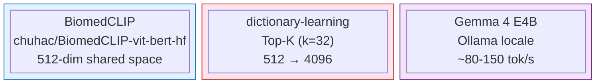
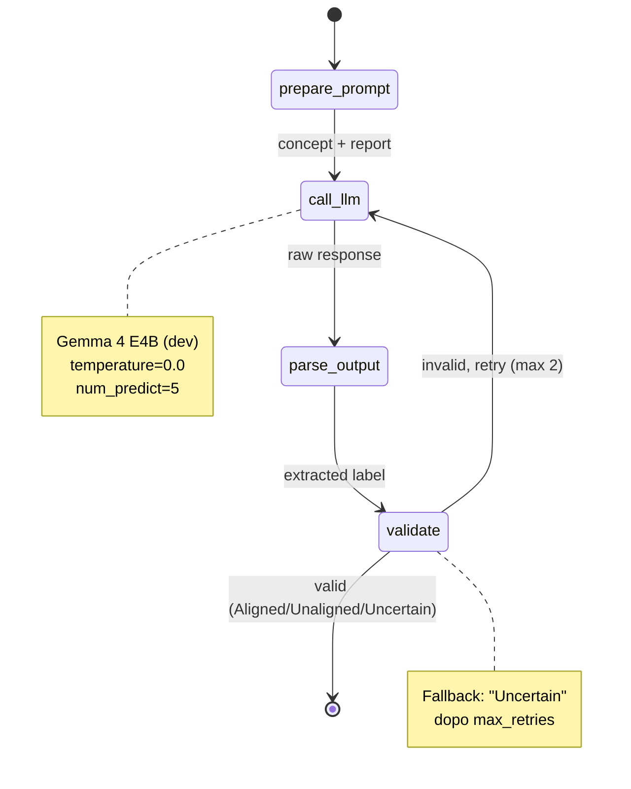

# Piano Implementativo Definitivo v2 — Progetto 5 XAI 2025/26
## Unsupervised Concept Discovery per Medical VLM

**Gruppo**: 3 persone, esperienza DL solida
**Hardware**: RTX 5070 8GB VRAM + 32GB RAM | Mac Mini M2 8GB RAM
**Tempo**: 3–4 settimane
**Stack**: HuggingFace `transformers` + PyTorch + LangGraph + Google AI Studio

---

## Decisioni Architetturali Definitive



### 1. Backbone VLM — BiomedCLIP via HuggingFace `transformers`

**Modello**: `chuhac/BiomedCLIP-vit-bert-hf`
**Perché**: porting HF-native completo di BiomedCLIP Microsoft, zero dipendenze da `open_clip`, API identica a qualunque altro modello HF. Pretrained su 15M coppie figura-caption da PubMed Central, SOTA per chest X-ray.

```python
from transformers import AutoModel, AutoProcessor

model = AutoModel.from_pretrained(
    "chuhac/BiomedCLIP-vit-bert-hf",
    trust_remote_code=True
)
processor = AutoProcessor.from_pretrained(
    "chuhac/BiomedCLIP-vit-bert-hf",
    trust_remote_code=True
)
model.eval().to("cuda")
```

- Embedding visivo: `d_model = 512`
- Embedding testuale: stesso spazio semantico (`d_model = 512`)
- Usato **frozen** — nessun fine-tuning del backbone (non richiesto dal progetto)

### 2. SAE — `dictionary-learning` (saprmarks), architettura Top-K

```bash
pip install dictionary-learning
```

**Iperparametri fissati**:
| Parametro | Valore | Motivazione |
|-----------|--------|-------------|
| `d_in` | 512 | output ViT BiomedCLIP |
| `d_hidden` | 4096 | espansione 8×, standard letteratura |
| `k` | 32 | top-k attivazioni per sample |
| `lr` | 5e-5 | stabile per SAE su embedding CLIP |
| `batch_size` | 256 | ~1.5GB VRAM, dentro i limiti RTX 5070 |
| Training steps | 50.000 | ~25 min su RTX 5070 |

### 3. LLM Judge — Doppio setup (dev + finale)

| Fase | Modello | Come | Costo |
|------|---------|------|-------|
| **Sviluppo / test** | Gemma 4 E4B (`gemma4:4b`) | Ollama locale, ~4GB VRAM | Gratuito |
| **Valutazione finale** | Gemma 4 26B-A4B | Google AI Studio API (free tier) | Gratuito |

> **Perché non il 26B locale**: in Q4_K_M richiede ~17GB file GGUF e 20GB VRAM minima.
> Con partial CPU offload su 8GB VRAM diventa troppo lento per 2.500+ chiamate.
> La Google AI Studio API è gratuita per uso research e fornisce la qualità piena del modello.

### 4. Pipeline Orchestration — LangGraph (solo modulo LLM-Judge)

LangGraph gestisce il modulo di valutazione semantica. Non è usato per feature extraction o SAE (puro PyTorch).



**Struttura del grafo LangGraph per il judge**:
```
[START]
  ↓
[prepare_prompt] → costruisce il prompt con concept + report
  ↓
[call_llm] → chiama Gemma 4 E4B (dev) o 26B API (finale)
  ↓
[parse_output] → StructuredOutputParser → {Aligned | Unaligned | Uncertain}
  ↓
[validate] → se output non valido, retry (max 2)
  ↓
[END] → salva risultato
```

### 5. Dataset — IU X-ray (subito) + MIMIC-CXR (se approvati)

- **IU X-ray**: scaricabile subito, 7.470 immagini + report XML. Usare per tutto lo sviluppo.
- **MIMIC-CXR**: registrarsi su PhysioNet **oggi** con email `@studenti.polito.it`. Approvazione ~3-7 giorni.

### 6. Concept Vocabulary

- Seed: 14 label NIH ChestX-ray14
- Espansione: sinonimi medici via `scispacy` + concetti anatomici manuali
- Totale: ~300-500 termini
- Naming: cosine similarity tra decoder vector SAE e text embedding BiomedCLIP

---

## Struttura del Repository

```
project-xai-p5/
├── data/
│   ├── iu_xray/
│   │   ├── images/             # PNG delle radiografie
│   │   └── reports/            # XML con Findings + Impression
│   └── mimic_cxr/              # se approvati su PhysioNet
├── embeddings/
│   ├── visual_embeddings.pt    # tensor (N, 512), frozen BiomedCLIP
│   └── text_vocab_embeddings.pt # tensor (V, 512), vocabolario medico
├── models/
│   ├── sae_seed0.pt
│   ├── sae_seed42.pt
│   ├── sae_seed123.pt
│   ├── sae_seed456.pt
│   └── sae_seed789.pt
├── results/
│   ├── concept_names.json       # {feature_id: {name, similarity_score}}
│   ├── sample_explanations.json # per-sample pseudo-report + top-k concepts
│   ├── aligned_scores.csv       # metriche Aligned/Unaligned/Uncertain
│   └── stability_analysis.csv  # Jaccard similarity tra seed
├── src/
│   ├── 01_extract_embeddings.py
│   ├── 02_train_sae.py
│   ├── 03_concept_naming.py
│   ├── 04_generate_explanations.py
│   ├── 05_evaluate_llm_judge.py   # LangGraph
│   └── 06_stability_analysis.py   # contributo originale
├── notebooks/
│   └── analysis_and_figures.ipynb
├── requirements.txt
└── report/
    ├── recap_document.pdf
    └── slides.pptx
```

---

## `requirements.txt`

```
torch>=2.2.0
transformers>=4.40.0
dictionary-learning
langchain-core>=0.2.0
langgraph>=0.1.0
langchain-google-genai        # Gemma 4 26B via AI Studio
google-generativeai
sentence-transformers
scikit-learn
pandas
numpy
matplotlib
seaborn
tqdm
Pillow
lxml
scispacy
ollama
```

---

## Piano Settimana per Settimana

```mermaid
gantt
    title Piano Implementativo
    dateFormat X
    axisFormat Giorno %s

    section Setup
    Repo + env + download      :s1, 1, 2d
    Parser dataset              :s2, 2, 1d
    Feature extraction          :s3, 3, 3d

    section Core Pipeline
    SAE Training (×5 seeds)     :crit, s4, 6, 4d
    Concept Naming              :s5, 8, 2d
    Explanation Generation      :s6, 10, 2d
    LLM Judge Evaluation        :crit, s7, 12, 3d

    section Extensions
    Stability Analysis          :s8, 15, 2d
    Clustering + Layer Comp.    :s9, 15, 3d
    Bias Analysis               :s10, 17, 2d

    section Deliverables
    Figures & Notebook          :s11, 19, 2d
    Report + Slide              :s12, 20, 3d
    Dry-run                     :milestone, s13, 23, 1d
```



### Settimana 1 — Setup, Dati, Feature Extraction

#### Giorno 1 (Persona A — DevOps & Setup)
- [ ] Clonare repo, creare virtualenv, installare `requirements.txt`
- [ ] Scaricare IU X-ray da Academic Torrents
- [ ] **Registrarsi su PhysioNet per MIMIC-CXR** (farlo subito)
- [ ] Ottenere API key Google AI Studio (gratuita)
- [ ] Installare Ollama + `ollama pull gemma4:4b`

#### Giorno 2 (Persona B — Data)
- [ ] Parser XML IU X-ray: estrarre `study_id`, `image_path`, `findings`, `impression`
- [ ] Creare `reports.csv` con colonne `[image_id, findings, impression, combined_text]`
- [ ] Train/val/test split: 70/10/20 stratificato

#### Giorno 3-5 (Persona A + C — Feature Extraction)

**Script `01_extract_embeddings.py`**:
```python
from transformers import AutoModel, AutoProcessor
import torch
from torch.utils.data import DataLoader
from PIL import Image
import pandas as pd

model = AutoModel.from_pretrained(
    "chuhac/BiomedCLIP-vit-bert-hf",
    trust_remote_code=True
).eval().to("cuda")
processor = AutoProcessor.from_pretrained(
    "chuhac/BiomedCLIP-vit-bert-hf",
    trust_remote_code=True
)

# Estrazione embedding visivi
all_embeddings = []
for batch in DataLoader(image_dataset, batch_size=128):
    inputs = processor(images=batch, return_tensors="pt").to("cuda")
    with torch.no_grad():
        outputs = model.get_image_features(**inputs)   # (B, 512)
        outputs = outputs / outputs.norm(dim=-1, keepdim=True)  # L2 norm
    all_embeddings.append(outputs.cpu())

visual_embeddings = torch.cat(all_embeddings)          # (N, 512)
torch.save(visual_embeddings, "embeddings/visual_embeddings.pt")

# Estrazione embedding vocabolario medico
vocab_terms = load_medical_vocabulary()  # lista ~400 termini
text_inputs = processor(text=vocab_terms, return_tensors="pt",
                        padding=True, truncation=True).to("cuda")
with torch.no_grad():
    text_embeddings = model.get_text_features(**text_inputs)
    text_embeddings = text_embeddings / text_embeddings.norm(dim=-1, keepdim=True)
torch.save(text_embeddings, "embeddings/text_vocab_embeddings.pt")
```

**Tempi stimati su RTX 5070**: ~15 min per ~7.000 immagini IU X-ray, batch 128.

---

### Settimana 2 — Training SAE e Concept Naming

#### Giorno 6-7 (Persona A)

**Script `02_train_sae.py`**:
```python
from dictionary_learning import BatchTopKTrainer
import torch

embeddings = torch.load("embeddings/visual_embeddings.pt")  # (N, 512)

trainer = BatchTopKTrainer(
    d_in=512,
    d_hidden=4096,
    k=32,
    lr=5e-5,
    device="cuda"
)
trainer.fit(
    embeddings,
    steps=50_000,
    batch_size=256,
    save_path="models/sae_seed0.pt",
    seed=0
)
```

Ripetere con seed `[0, 42, 123, 456, 789]` per la stability analysis (script `06`).
**Tempo totale**: ~2.5h per tutti e 5 i run.

#### Giorno 7-8 (Persona B)

**Script `03_concept_naming.py`**:
```python
import torch
import json
from dictionary_learning import load_sae

sae = load_sae("models/sae_seed0.pt")
W_dec = sae.W_dec   # (4096, 512) — decoder vectors

text_embs = torch.load("embeddings/text_vocab_embeddings.pt")  # (V, 512)
vocab_terms = load_vocabulary_list()

# Cosine similarity: (4096, 512) × (512, V) → (4096, V)
similarity = W_dec @ text_embs.T

# Per ogni feature: concept = argmax similarity
best_match_idx = similarity.argmax(dim=-1)    # (4096,)
best_match_score = similarity.max(dim=-1).values  # (4096,)

concept_dict = {
    i: {
        "name": vocab_terms[best_match_idx[i]],
        "score": best_match_score[i].item()
    }
    for i in range(4096)
}
with open("results/concept_names.json", "w") as f:
    json.dump(concept_dict, f, indent=2)
```

#### Giorno 8-9 (Persona C — Analisi qualitativa)
- Ispezionare manualmente i top-50 concetti per confidenza
- Identificare concetti duplicati, ambigui, non-clinici
- Costruire lista `failure_cases_candidates.json` per la sezione failure analysis

---

### Settimana 3 — Generazione Spiegazioni e Valutazione LLM-Judge

#### Giorno 10-11 (Persona A)

**Script `04_generate_explanations.py`**:
```python
sae = load_sae("models/sae_seed0.pt")
concept_names = json.load(open("results/concept_names.json"))

explanations = []
for image_id, embedding in test_embeddings:
    # SAE encode → sparse activations
    activations = sae.encode(embedding)         # (4096,)
    top_k_idx = activations.topk(5).indices
    top_k_concepts = [
        {
            "feature_id": int(idx),
            "name": concept_names[str(int(idx))]["name"],
            "activation": float(activations[idx])
        }
        for idx in top_k_idx
    ]
    pseudo_report = "The model identified: " + ", ".join(
        f"{c['name']} ({c['activation']:.2f})"
        for c in top_k_concepts
    )
    explanations.append({
        "image_id": image_id,
        "top_k_concepts": top_k_concepts,
        "pseudo_report": pseudo_report
    })

json.dump(explanations, open("results/sample_explanations.json", "w"), indent=2)
```

#### Giorno 11-14 (Persona B + C)

**Script `05_evaluate_llm_judge.py`** con LangGraph:
```python
from langgraph.graph import StateGraph, END
from langchain_google_genai import ChatGoogleGenerativeAI
from langchain_core.output_parsers import StrOutputParser
from langchain_core.prompts import ChatPromptTemplate
from typing import TypedDict, Literal
import pandas as pd

# Dev: Ollama gemma4:4b locale
# Finale: Gemma 4 26B-A4B via Google AI Studio
llm = ChatGoogleGenerativeAI(model="gemma-4-26b-a4b", temperature=0)

PROMPT = ChatPromptTemplate.from_template("""You are a clinical AI evaluator.
Radiology report: "{report}"
Discovered concept: "{concept}"
Does the report SUPPORT, CONTRADICT, or is AMBIGUOUS about this concept?
Answer with exactly one word: Aligned, Unaligned, or Uncertain.""")

class JudgeState(TypedDict):
    concept: str
    report: str
    result: str
    retries: int

def call_llm(state: JudgeState) -> JudgeState:
    chain = PROMPT | llm | StrOutputParser()
    state["result"] = chain.invoke({
        "concept": state["concept"],
        "report": state["report"]
    }).strip()
    return state

def validate(state: JudgeState) -> Literal["valid", "retry", "end"]:
    if state["result"] in {"Aligned", "Unaligned", "Uncertain"}:
        return "valid"
    if state["retries"] < 2:
        state["retries"] += 1
        return "retry"
    state["result"] = "Uncertain"  # fallback
    return "end"

graph = StateGraph(JudgeState)
graph.add_node("call_llm", call_llm)
graph.add_conditional_edges("call_llm", validate, {
    "valid": END, "retry": "call_llm", "end": END
})
graph.set_entry_point("call_llm")
judge = graph.compile()

# Esecuzione su test set
records = []
explanations = json.load(open("results/sample_explanations.json"))
reports_df = pd.read_csv("data/iu_xray/reports.csv")

for item in explanations:
    report = reports_df.loc[reports_df.image_id == item["image_id"], "combined_text"].iloc[0]
    for concept in item["top_k_concepts"]:
        result = judge.invoke({
            "concept": concept["name"],
            "report": report,
            "result": "",
            "retries": 0
        })
        records.append({
            "image_id": item["image_id"],
            "concept": concept["name"],
            "activation": concept["activation"],
            "verdict": result["result"]
        })

pd.DataFrame(records).to_csv("results/aligned_scores.csv", index=False)
```

**Tempo stimato**: ~2-4h per 500 campioni × 5 concetti su Gemma 4 E4B locale; molto più veloce via API 26B.

---

### Settimana 4 — Contributo Originale, Analisi, Scrittura

#### Giorno 14-16 (Persona A) — Stability Analysis (contributo originale)

**Script `06_stability_analysis.py`**:
```python
from itertools import combinations
import json, torch
import pandas as pd

seeds = [0, 42, 123, 456, 789]

def get_top_concepts(sae_path, top_n=500):
    """Ritorna i nomi dei top_n concetti più frequentemente attivati."""
    sae = load_sae(sae_path)
    activations_all = []
    for emb_batch in embedding_batches:
        activations_all.append(sae.encode(emb_batch))
    mean_activation = torch.cat(activations_all).mean(dim=0)   # (4096,)
    top_idx = mean_activation.topk(top_n).indices.tolist()
    return set(concept_names[str(i)]["name"] for i in top_idx)

records = []
for s1, s2 in combinations(seeds, 2):
    c1 = get_top_concepts(f"models/sae_seed{s1}.pt")
    c2 = get_top_concepts(f"models/sae_seed{s2}.pt")
    jaccard = len(c1 & c2) / len(c1 | c2)
    records.append({"seed_1": s1, "seed_2": s2, "jaccard": jaccard})

df = pd.DataFrame(records)
df.to_csv("results/stability_analysis.csv", index=False)
print(f"Mean Jaccard: {df['jaccard'].mean():.3f} ± {df['jaccard'].std():.3f}")
```

Risultato atteso: valore tipo `0.58 ± 0.07` — primo dato quantitativo sulla stabilità dei concetti nei medical VLM, non presente in letteratura.

#### Giorno 16-18 (Persona C + tutti) — Figure e Scrittura

**Figure da produrre** (tutte nel notebook `analysis_and_figures.ipynb`):

1. **Fig. 1 — Distribuzione metriche semantiche per patologia**: stacked barplot Aligned/Unaligned/Uncertain per classe.
2. **Fig. 2 — Top-20 Concepts**: barplot activation score + Aligned% per i 20 concetti più frequenti.
3. **Fig. 3 — Stability Analysis**: boxplot Jaccard similarity tra coppie di seed.
4. **Fig. 4 — Failure Cases**: 3-5 esempi annotati: immagine, concetto scoperto, report reale, verdetto del judge + analisi.
5. **Fig. 5 (opzionale) — Layer Comparison**: Aligned% in funzione del layer ViT estratto (se implementato).

---

## Research Gaps da Citare nel Report

Pronti per la sezione "Identification of Research Gaps":

1. **Instabilità dei concetti**: nessun approccio misura la variabilità tra run con seed diversi → la stability analysis risponde direttamente a questo.
2. **Dipendenza da risorse esterne**: MedConcept richiede UMLS; la proposta usa il text encoder del VLM stesso come vocabolario implicito.
3. **Bias del LLM giudice**: position bias, verbosity bias, allucinazione medica non risolti in MedConcept.
4. **Report clinici incompleti**: Aligned/Unaligned/Uncertain assume copertura totale del report, ma i radiologi documentano solo anomalie salienti.
5. **Indipendenza dei concetti**: nessun approccio modella co-occorrenze, gerarchie anatomiche o relazioni causali tra concetti.
6. **Layer-specific semantics non studiati su VLM medici**: SAE-for-VLM (NeurIPS 2025) analizza layer su modelli general-purpose, non su VLM specializzati come BiomedCLIP.

---

## Gestione Hardware

| Task | Device | VRAM/RAM | Tempo stimato |
|------|--------|----------|---------------|
| Feature extraction BiomedCLIP | RTX 5070 | ~2 GB VRAM | ~15 min |
| SAE training (1 run) | RTX 5070 | ~2.5 GB VRAM | ~25 min |
| SAE training (5 run totali) | RTX 5070 | ~2.5 GB VRAM | ~2h |
| Concept naming (similarity) | RTX 5070 o CPU | <1 GB | ~2 min |
| LLM Judge dev (Gemma 4 E4B) | RTX 5070 | ~4 GB VRAM | ~2-4h |
| LLM Judge finale (Gemma 4 26B) | Google AI Studio API | — | ~30 min |
| Stability analysis | RTX 5070 | ~2.5 GB VRAM | ~2h |
| Figure e analisi | Qualsiasi | — | — |

> ⚠️ SAE training e LLM Judge **non girano in contemporanea** sulla stessa GPU.
> Eseguirli in sequenza: prima estrazione + training, poi liberare VRAM per Ollama.

---

## Divisione del Lavoro

| Persona | Responsabilità | Script |
|---------|---------------|--------|
| **A** | Setup, feature extraction, SAE training, stability analysis | `01`, `02`, `06` |
| **B** | Data parsing, concept naming, analisi qualitativa | `03`, `04`, XML parser |
| **C** | LLM Judge (LangGraph), statistiche, figure, scrittura | `05`, notebook, report |

---

## Check-list Finale pre-Submission

- [ ] `visual_embeddings.pt` estratto da tutto il dataset
- [ ] SAE addestrato con 5 seed, tutti i checkpoint salvati
- [ ] `concept_names.json` completo per tutte le 4096 feature
- [ ] `sample_explanations.json` per ≥ 300 campioni test
- [ ] `aligned_scores.csv` con metriche Aligned/Unaligned/Uncertain
- [ ] `stability_analysis.csv` con Jaccard tra seed
- [ ] Almeno 3 failure cases documentati con analisi
- [ ] Tutte le 4-5 figure prodotte
- [ ] Recap document 2-3 pagine (template docenti)
- [ ] Slide pronte (15 min + 15 min discussione)
- [ ] Repository GitHub **pubblico** con `README.md` + `requirements.txt`
- [ ] ZIP su Portale della Didattica (slide + doc + repo link + dati IU X-ray subset)
