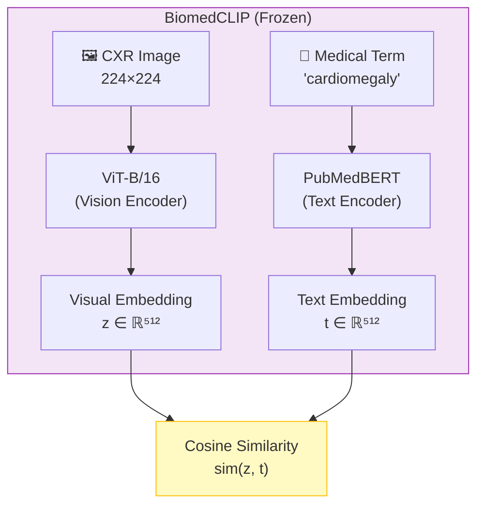
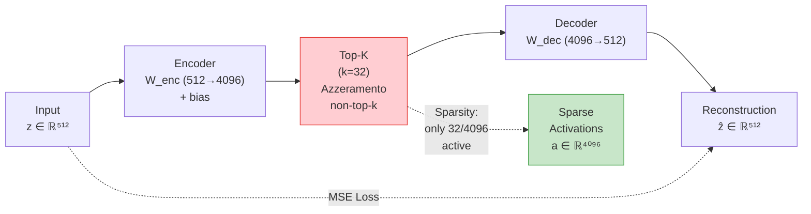
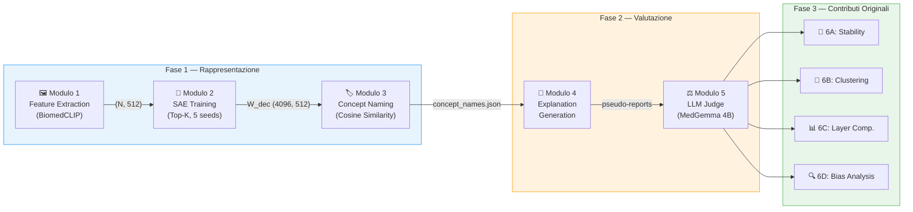
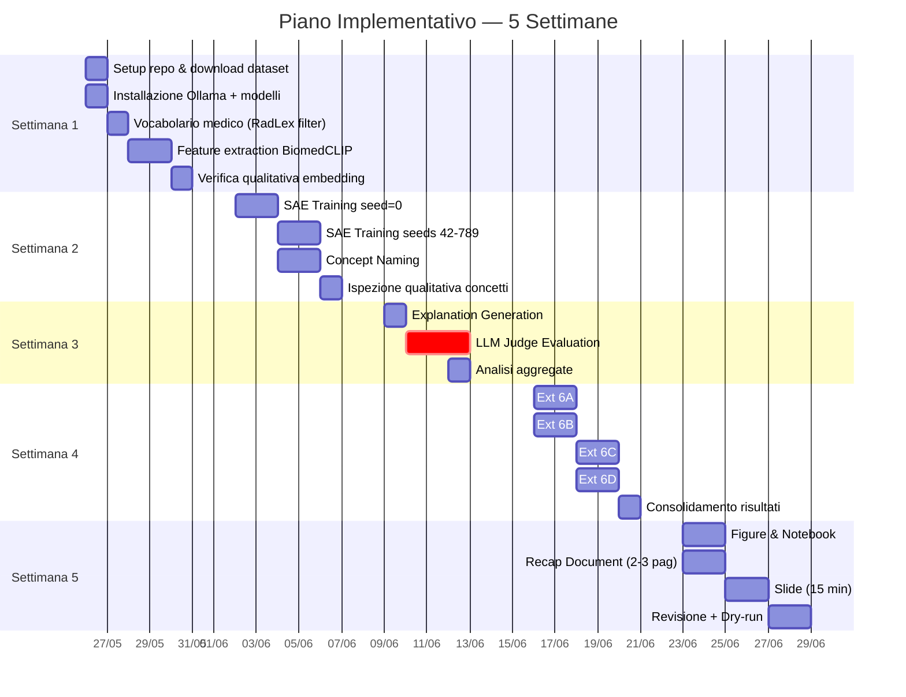
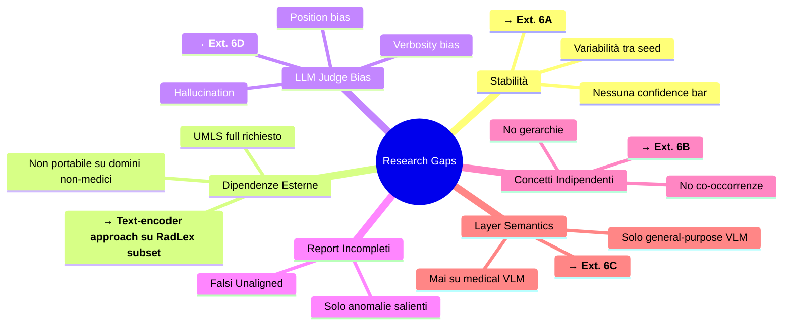
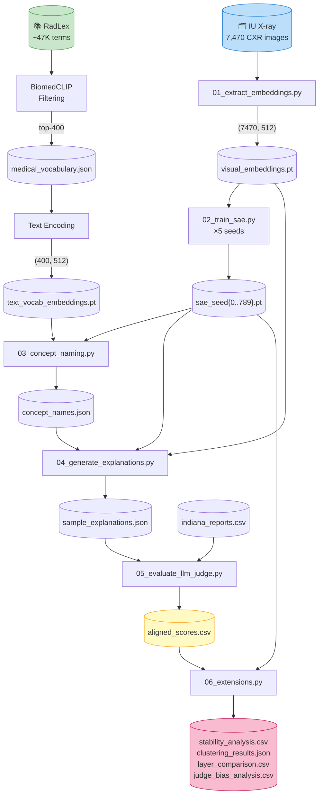

> [!WARNING]
> **DOCUMENT STATUS: HISTORICAL REFERENCE — SUPERSEDED**
>
> This document contains implementation notes written during the original project phase,
> when the SAE on the 512-d projected embedding was the intended primary method.
> Following methodological audit `ML-AUDIT-2026-06-25.md` (finding M-001), the project
> strategy has been reframed. **Do not use this document to plan new work.**
>
> **Active documents:**
> - `docs/design/PROJECT-STRATEGY.md` — revised strategy v2.0
> - `docs/design/IMPLEMENTATION-PLAN.md` — implementation plan v3.0
> - `docs/design/proposals/PIPELINE-REFRAME-MAIN-VS-BASELINE.md` — reframe rationale
>
> This file is kept for historical traceability. The implementation notes below remain
> useful as reference for the **baseline** (512-d SAE) code, which is fully implemented.

---

# Piano Implementativo Definitivo — Progetto 5 XAI 2025/26
## Unsupervised Concept Discovery and Evaluation for Medical Vision–Language Models

**Versione**: 2.0 — allineato con knowledge base (LaTeX report)
**Gruppo**: 3 persone
**Hardware principale**: RTX 5070 8GB VRAM + 32GB RAM
**Hardware secondario**: Mac Mini M2 8GB RAM
**Tempo stimato**: 4–5 settimane
**Branch di sviluppo**: `dev`

---

## 1. Decisioni Architetturali Consolidate

### 1.1 Backbone VLM — BiomedCLIP (HuggingFace Transformers)

**Modello**: [`chuhac/BiomedCLIP-vit-bert-hf`](https://huggingface.co/chuhac/BiomedCLIP-vit-bert-hf)  
**Tipo**: Community port HF-native del modello Microsoft originale  
**Perché questa scelta**:
- API standard `transformers` (`AutoModel`, `AutoProcessor`) — nessuna dipendenza da `open_clip`
- Pretrained su 15M coppie figura-caption da PubMed Central
- Embedding dimensione: **d_model = 512** (visivo e testuale nello stesso spazio)
- 0.2B parametri, ~350MB in fp32, inference leggera
- 36K+ downloads/mese — community attiva

**Modello originale Microsoft** (per reference): [`microsoft/BiomedCLIP-PubMedBERT_256-vit_base_patch16_224`](https://huggingface.co/microsoft/BiomedCLIP-PubMedBERT_256-vit_base_patch16_224) — richiede `open_clip`, stessi pesi.

**Uso**: frozen inference only, nessun fine-tuning.

```python
from transformers import AutoModel, AutoProcessor
import torch

model = AutoModel.from_pretrained("chuhac/BiomedCLIP-vit-bert-hf", trust_remote_code=True)
processor = AutoProcessor.from_pretrained("chuhac/BiomedCLIP-vit-bert-hf", trust_remote_code=True)
model.eval().to("cuda")
```

> ⚠️ **VERIFICA API NECESSARIA**: Essendo un modello con `trust_remote_code=True` (codice custom),
> i metodi `.get_image_features()` e `.get_text_features()` vanno verificati al primo run.
> Se non disponibili, usare l'output diretto:
> ```python
> outputs = model(pixel_values=inputs["pixel_values"], input_ids=inputs["input_ids"])
> image_emb = outputs.image_embeds  # verificare nome attributo
> text_emb = outputs.text_embeds
> ```
> **Prima azione della Settimana 1**: testare il modello con 1 immagine e 1 testo per validare l'API.

### 1.1.1 Architettura BiomedCLIP



### 1.2 Sparse Autoencoder — `dictionary-learning` (pip)

**Libreria**: [`saprmarks/dictionary_learning`](https://github.com/saprmarks/dictionary_learning) v0.1.0  
**Architettura scelta**: **AutoEncoderTopK** (Top-K SAE)

> ⚠️ **NOTA API CORRETTA**: La libreria usa `trainSAE()` con un dict di configurazione, non un metodo `.fit()`.  
> Le classi disponibili sono: `AutoEncoderTopK`, `AutoEncoder`, `GatedAutoEncoder`, etc.  
> I trainer sono: `TopKTrainer`, `BatchTopKSAETrainer`, `StandardTrainer`, `GatedSAETrainer`.

**Iperparametri**:

| Parametro | Valore | Motivazione |
|-----------|--------|-------------|
| `activation_dim` | 512 | dimensione output ViT BiomedCLIP |
| `dict_size` | 4096 | espansione 8×, standard letteratura SAE |
| `k` | 32 | top-k attivazioni per sample (range letteratura: 20-50) |
| `lr` | 1e-3 | default TopKTrainer, warmup incluso |
| Training steps | 50.000 | ~25 min su RTX 5070 per run |
| Seed | [0, 42, 123, 456, 789] | 5 run per stability analysis |

**Codice corretto con API reale**:
```python
from dictionary_learning.trainers.top_k import TopKTrainer, AutoEncoderTopK
from dictionary_learning.training import trainSAE
import torch

# Caricare embedding pre-estratti come "buffer" custom
embeddings = torch.load("embeddings/visual_embeddings.pt")  # (N, 512)

trainer_cfg = {
    "trainer": TopKTrainer,
    "dict_class": AutoEncoderTopK,
    "activation_dim": 512,
    "dict_size": 4096,
    "k": 32,
    "lr": 1e-3,
    "device": "cuda",
    "steps": 50_000,
    "seed": 0,
    "warmup_steps": 1000,
    "layer": 0,
    "lm_name": "BiomedCLIP",
}

# trainSAE accetta un DataLoader o ActivationBuffer
# Per embedding pre-calcolati: creare un semplice DataLoader PyTorch
# NOTA: TensorDataset wrappa in tuple (tensor,). Se trainSAE non accetta tuple,
# usare un generatore custom:
from torch.utils.data import DataLoader, TensorDataset

dataset = TensorDataset(embeddings)
buffer = DataLoader(dataset, batch_size=256, shuffle=True)

# Alternativa se DataLoader dà problemi con trainSAE:
# def embedding_generator(embeddings, batch_size=256):
#     indices = torch.randperm(len(embeddings))
#     for i in range(0, len(indices), batch_size):
#         yield embeddings[indices[i:i+batch_size]]

ae = trainSAE(
    data=buffer,
    trainer_configs=[trainer_cfg],
    steps=50_000,
)
```

> **Alternativa `sae-for-vlm`**: Il repo [`ExplainableML/sae-for-vlm`](https://github.com/ExplainableML/sae-for-vlm) include un fork interno di `dictionary_learning/` con script `sae_train.py` già configurati per CLIP. Se l'API standalone dà problemi, clonare quel repo e adattare i loro script.

### 1.2.1 Architettura SAE Top-K



### 1.3 LLM Judge — MedGemma 4B (Unsloth GGUF Q4 via Ollama)

**Modello**: [`google/medgemma-4b-it`](https://huggingface.co/google/medgemma-4b-it) (~4B parametri, Gemma 3 fine-tuned su dati medici)  
**Quantizzazione**: [`unsloth/medgemma-4b-it-GGUF`](https://huggingface.co/unsloth/medgemma-4b-it-GGUF) — Q4_K_M (2.49 GB) con Unsloth Dynamic 2.0  
**Deploy**: Ollama locale, interamente su GPU  
**Perché MedGemma + Unsloth GGUF**:
- È il **modello usato nel paper MedConcept originale** per la valutazione LLM-as-a-Judge
- Pre-addestrato su CXR, radiologia, patologia, dermatologia, oftalmologia
- SigLIP image encoder specializzato su dati medici de-identificati
- 81.2% macro F1 su MIMIC-CXR (top 5 condizioni) — comprensione radiologica nativa
- Unsloth Dynamic 2.0 quantization: **qualità superiore** rispetto a GGUF standard a parità di bit
- **~2.5 GB VRAM** in Q4_K_M → massimo headroom sulla RTX 5070 (8GB)
- Nessun CPU offloading → inferenza veloce (~100-200 tok/s a Q4)
- ~0.3-0.5 sec per chiamata judge
- Nessuna API esterna, zero costi, completamente riproducibile
- Allineamento diretto con la metodologia del paper di riferimento

**Paper di riferimento**: Sellergren et al., "MedGemma Technical Report", arXiv:2507.05201, 2025.

```bash
# Setup — due opzioni:

# Opzione A: Ollama pull da HuggingFace GGUF (più diretto)
ollama pull hf.co/unsloth/medgemma-4b-it-GGUF:Q4_K_M

# Opzione B: Download manuale + Modelfile custom
# 1. Scaricare GGUF
huggingface-cli download unsloth/medgemma-4b-it-GGUF medgemma-4b-it-Q4_K_M.gguf --local-dir models/

# 2. Creare Modelfile
cat > models/Modelfile.medgemma <<EOF
FROM ./medgemma-4b-it-Q4_K_M.gguf
PARAMETER temperature 0.0
PARAMETER num_predict 10
SYSTEM "You are a clinical radiology AI evaluator."
EOF

# 3. Creare modello Ollama
ollama create medgemma-judge -f models/Modelfile.medgemma

# Fallback: se HF GGUF dà problemi, usare il tag ufficiale Ollama
# ollama pull medgemma:4b
```

**Implementazione Judge (Python puro, KISS)**:
```python
import ollama
import json

# Nome modello: dipende dal setup scelto
MODEL_NAME = "hf.co/unsloth/medgemma-4b-it-GGUF:Q4_K_M"  # oppure "medgemma-judge" se custom

JUDGE_PROMPT = """You are a clinical radiology AI evaluator.

Given:
- Radiology report: "{report}"
- Discovered concept: "{concept}"

Determine if the radiology report SUPPORTS, CONTRADICTS, or is AMBIGUOUS about the presence/relevance of this concept.

Rules:
- SUPPORTS (Aligned): The report explicitly mentions or implies this finding/concept.
- CONTRADICTS (Unaligned): The report explicitly denies or contradicts this concept.
- AMBIGUOUS (Uncertain): The report does not mention this concept, or the relationship is unclear.

Answer with EXACTLY one word: Aligned, Unaligned, or Uncertain."""

VALID_LABELS = {"Aligned", "Unaligned", "Uncertain"}

def judge_concept(concept: str, report: str, max_retries: int = 2) -> str:
    """Chiama MedGemma 4B Q4 locale per valutare un concetto vs report."""
    prompt = JUDGE_PROMPT.format(concept=concept, report=report)
    
    for attempt in range(max_retries + 1):
        response = ollama.chat(
            model=MODEL_NAME,
            messages=[{"role": "user", "content": prompt}],
            options={"temperature": 0.0, "num_predict": 5}
        )
        result = response["message"]["content"].strip()
        
        # Parse: prendi la prima parola valida
        for word in result.split():
            if word in VALID_LABELS:
                return word
        
        # Se non parsato, retry
    
    return "Uncertain"  # fallback dopo max_retries
```

> **Opzione LangChain per slide/report** (se volete mostrarlo):
> ```python
> from langchain_ollama import ChatOllama
> from langchain_core.prompts import ChatPromptTemplate
> from langchain_core.output_parsers import StrOutputParser
> 
> llm = ChatOllama(model=MODEL_NAME, temperature=0)
> chain = prompt_template | llm | StrOutputParser()
> ```

### 1.4 Dataset

| Dataset | Ruolo | Accesso | Link |
|---------|-------|---------|------|
| **IU X-ray (OpenI)** | Sviluppo + valutazione principale | Libero, no registrazione | [OpenI NLM](https://openi.nlm.nih.gov/) |
| **MIMIC-CXR** | Valutazione scalabile (opzionale) | PhysioNet, richiede approvazione | [PhysioNet](https://physionet.org/content/mimic-cxr/2.0.0/) |

**IU X-ray specifiche**:
- 7.470 immagini chest X-ray
- 3.955 report radiologici (XML con `Findings` + `Impression`)
- Scaricabile da: `https://openi.nlm.nih.gov/` → sezione Chest X-rays
- Alternativa download bulk: [GitHub dataset reference](https://github.com/openmedlab/Awesome-Medical-Dataset/blob/main/resources/IU-Xray.md)

**MIMIC-CXR**: registrarsi su PhysioNet con email `@studenti.polito.it`. Richiede CITI training + approvazione (3-7 giorni). **Fallback**: se non approvati in tempo, IU X-ray è sufficiente per tutti i requisiti del progetto.

### 1.5 Concept Vocabulary — UMLS/RadLex

**Strategia**: Vocabolario derivato dall'**UMLS** (Unified Medical Language System), utilizzando **RadLex** come sotto-ontologia radiologica specializzata (~46K termini), filtrato con BiomedCLIP bi-encoder.

> **Relazione UMLS/RadLex**: L'UMLS è il meta-thesaurus medico di riferimento (NLM, ~4M concetti).
> RadLex è il vocabolario RSNA specifico per la radiologia, integrato nell'UMLS.
> Il paper MedConcept utilizza UMLS; noi usiamo RadLex (sotto-vocabolario UMLS)
> perché è il subset più rilevante per CXR e fornisce terminologia radiologica curata.
> Questo approccio è equivalente a filtrare UMLS per il dominio radiologico.

**Accesso UMLS**: Registrazione gratuita per uso accademico su [UTS (UMLS Terminology Services)](https://uts.nlm.nih.gov/uts/) con email `@studenti.polito.it`. RadLex disponibile anche via [BioPortal](https://bioportal.bioontology.org/ontologies/RADLEX).

**Pipeline di creazione (script `src/00_build_vocabulary.py`)**:
1. Caricare `data/radlex.csv` (export BioPortal, ~47K righe) → estrarre colonna `Preferred Label`, filtrare righe non-obsolete
2. Codificare ogni termine con il text encoder di BiomedCLIP → embedding (N, 512)
3. Definire ~20 "anchor queries" CXR-specifiche (es. "chest radiograph finding", "lung pathology", "cardiac abnormality")
4. Calcolare cosine similarity tra ogni termine RadLex e il centroide delle anchor
5. Tenere i top-400 termini più simili + i 14 termini NIH ChestX-ray14 (seed fisso)
6. Salvare in `data/medical_vocabulary.json`

**Fonti dati**:
- RadLex v4.3 CSV (sotto-ontologia UMLS per radiologia): scaricato da [BioPortal](https://bioportal.bioontology.org/ontologies/RADLEX) → `data/radlex.csv` (~47K righe, colonne: `Class ID`, `Preferred Label`, `Synonyms`, `Definitions`, `Obsolete`, ...)
- NIH ChestX-ray14: 14 condizioni seed (Atelectasis, Cardiomegaly, Effusion, Infiltration, Mass, Nodule, Pneumonia, Pneumothorax, Consolidation, Edema, Emphysema, Fibrosis, Pleural Thickening, Hernia)
- UMLS Metathesaurus: [nlm.nih.gov/research/umls](https://www.nlm.nih.gov/research/umls/) (per reference/future extension)

**Esecuzione**:
```bash
python src/00_build_vocabulary.py --csv data/radlex.csv --topk 400
```

**Vantaggi dell'approccio bi-encoder**:
- Filtraggio nello STESSO spazio embedding usato per il concept naming → massima coerenza
- Riproducibile al 100% (deterministico dato il modello)
- Nessun vocabolario "inventato" manualmente
- Discutibile nel report come contributo metodologico

**Naming dei concetti SAE**: cosine similarity tra decoder vector SAE `W_dec[i]` e text embedding del vocabolario filtrato → nome = argmax.

---

## 2. Dataset e Preprocessing

### 2.1 Download IU X-ray

**Fonte**: [Kaggle — `raddar/chest-xrays-indiana-university`](https://www.kaggle.com/datasets/raddar/chest-xrays-indiana-university)

```bash
# Download con kaggle CLI
kaggle datasets download -d raddar/chest-xrays-indiana-university -p data/iu_xray/ --unzip
```

```bash
# Struttura dopo unzip
data/
├── iu_xray/
│   ├── images/
│   │   └── images_normalized/    # PNG normalizzate (7470 file)
│   ├── indiana_reports.csv       # Report con colonne: uid, MeSH, Problems, image, indication, findings, impression
│   └── indiana_projections.csv   # Metadata proiezioni (Frontal/Lateral per immagine)
```

> **Nota path immagini**: le PNG sono in `images/images_normalized/`, pattern nome: `{uid}_IM-{num}-{seq}`.
> Gli script usano `Path("data/iu_xray/images/images_normalized").glob("*.png")`.

> **Filtro frontali**: `indiana_projections.csv` permette di filtrare solo le proiezioni frontali se necessario.

### 2.2 Pre-processing Report (CSV → formato interno)

Il dataset Kaggle include già `indiana_reports.csv` con colonne strutturate. Non serve parsing XML.

```python
import pandas as pd

def load_iu_xray_reports(csv_path: str = "data/iu_xray/indiana_reports.csv") -> pd.DataFrame:
    """Carica i report IU X-ray dal CSV Kaggle e prepara il formato interno."""
    df = pd.read_csv(csv_path)
    
    # Colonne rilevanti: uid, findings, impression, image
    # Pulizia: riempire NaN, combinare findings + impression
    df["findings"] = df["findings"].fillna("")
    df["impression"] = df["impression"].fillna("")
    df["combined_text"] = (df["findings"] + " " + df["impression"]).str.strip()
    
    # La colonna 'image' contiene i nomi dei file (separati da |)
    # Espandere: ogni riga → una per immagine
    records = []
    for _, row in df.iterrows():
        if pd.isna(row.get("image")):
            continue
        images = str(row["image"]).split("|")
        for img_name in images:
            img_name = img_name.strip()
            if img_name:
                records.append({
                    "uid": row["uid"],
                    "image_id": img_name,
                    "findings": row["findings"],
                    "impression": row["impression"],
                    "combined_text": row["combined_text"],
                })
    
    return pd.DataFrame(records)
```

### 2.3 Split

Train/Val/Test = 70/15/15, stratificato per studio (tutti i frontal/lateral dello stesso studio nello stesso split).

> **Nota**: Il test set conterrà ~1.100 immagini. Per la valutazione LLM Judge (computazionalmente costosa),
> si usa un **subset di 500 campioni** test selezionati random. Le statistiche su 500 campioni sono
> sufficienti per confidence interval ragionevoli (± ~4% con 95% CI).

---

## 3. Pipeline in 6 Moduli



### Mapping con le Fasi MedConcept

La pipeline MedConcept originale definisce 3 fasi macro. I nostri 6 moduli le implementano con granularità maggiore:

| Fase MedConcept | Descrizione | Nostri Moduli |
|-----------------|-------------|---------------|
| **1. Extraction** | SAE decompone le rappresentazioni latenti del VLM in feature sparse monosemantiche | Modulo 1 (Feature Extraction) + Modulo 2 (SAE Training) |
| **2. Alignment** | Feature sparse allineate a terminologia clinica UMLS tramite cosine similarity nello spazio embedding condiviso | Modulo 3 (Concept Naming) |
| **3. Evaluation** | LLM-as-a-Judge valuta la coerenza semantica tra concetti estratti e referti clinici reali | Modulo 4 (Explanation Generation) + Modulo 5 (LLM Judge) |

> I Moduli 6A-6D sono **estensioni originali** che vanno oltre MedConcept, affrontando gap specifici della letteratura.

### Modulo 1 — Feature Extraction (`src/01_extract_embeddings.py`)

**Input**: Immagini CXR (PNG/JPEG)  
**Output**: `embeddings/visual_embeddings.pt` (N × 512), `embeddings/text_vocab_embeddings.pt` (V × 512)  
**Tempo**: ~15 min su RTX 5070 per ~7.000 immagini

```python
from transformers import AutoModel, AutoProcessor
import torch
from torch.utils.data import DataLoader
from PIL import Image
from pathlib import Path

model = AutoModel.from_pretrained("chuhac/BiomedCLIP-vit-bert-hf", trust_remote_code=True)
processor = AutoProcessor.from_pretrained("chuhac/BiomedCLIP-vit-bert-hf", trust_remote_code=True)
model.eval().to("cuda")

# --- Embedding visivi ---
image_paths = sorted(Path("data/iu_xray/images/images_normalized").glob("*.png"))
all_embeddings = []

for i in range(0, len(image_paths), 64):  # batch_size=64
    batch_paths = image_paths[i:i+64]
    images = [Image.open(p).convert("RGB") for p in batch_paths]
    inputs = processor(images=images, return_tensors="pt", padding=True).to("cuda")
    with torch.no_grad():
        outputs = model.get_image_features(**inputs)  # (B, 512)
        outputs = outputs / outputs.norm(dim=-1, keepdim=True)  # L2 norm
    all_embeddings.append(outputs.cpu())

visual_embeddings = torch.cat(all_embeddings)  # (N, 512)
torch.save(visual_embeddings, "embeddings/visual_embeddings.pt")

# --- Embedding vocabolario medico ---
vocab_terms = load_medical_vocabulary()  # funzione che carica i ~400 termini
# Processare in batch per non esaurire memoria
text_embeddings_list = []
for i in range(0, len(vocab_terms), 32):
    batch = vocab_terms[i:i+32]
    inputs = processor(text=batch, return_tensors="pt", padding=True, truncation=True).to("cuda")
    with torch.no_grad():
        text_emb = model.get_text_features(**inputs)
        text_emb = text_emb / text_emb.norm(dim=-1, keepdim=True)
    text_embeddings_list.append(text_emb.cpu())

text_embeddings = torch.cat(text_embeddings_list)  # (V, 512)
torch.save(text_embeddings, "embeddings/text_vocab_embeddings.pt")
```

### Modulo 2 — SAE Training (`src/02_train_sae.py`)

**Input**: `visual_embeddings.pt`  
**Output**: `models/sae_seed{X}.pt` per ciascun seed  
**Tempo**: ~25 min per run, ~2.5h per tutti e 5

```python
from dictionary_learning.trainers.top_k import TopKTrainer, AutoEncoderTopK
from dictionary_learning.training import trainSAE
from torch.utils.data import DataLoader, TensorDataset
import torch
import argparse

parser = argparse.ArgumentParser()
parser.add_argument("--seed", type=int, default=0)
parser.add_argument("--steps", type=int, default=50_000)
args = parser.parse_args()

torch.manual_seed(args.seed)

embeddings = torch.load("embeddings/visual_embeddings.pt")
dataset = TensorDataset(embeddings)
buffer = DataLoader(dataset, batch_size=256, shuffle=True)

trainer_cfg = {
    "trainer": TopKTrainer,
    "dict_class": AutoEncoderTopK,
    "activation_dim": 512,
    "dict_size": 4096,
    "k": 32,
    "lr": 1e-3,
    "device": "cuda",
    "steps": args.steps,
    "seed": args.seed,
    "warmup_steps": 1000,
    "layer": 0,
    "lm_name": "BiomedCLIP-iu-xray",
}

# trainSAE restituisce una LISTA (un SAE per ogni config in trainer_configs)
ae_list = trainSAE(data=buffer, trainer_configs=[trainer_cfg], steps=args.steps)
ae = ae_list[0]  # primo (e unico) SAE
torch.save(ae.state_dict(), f"models/sae_seed{args.seed}.pt")
```

```bash
# Eseguire per tutti i seed
for seed in 0 42 123 456 789; do
    python src/02_train_sae.py --seed $seed
done
```

### Modulo 3 — Concept Naming (`src/03_concept_naming.py`)

**Input**: SAE trained, text vocab embeddings  
**Output**: `results/concept_names.json` (per pipeline principale, seed=0)

> **Per la Stability Analysis (6A)**: il concept naming va rieseguito per ogni seed.
> Lo script 6A include questa logica internamente. Il `concept_names.json` in `results/`
> è quello della pipeline principale (seed=0).

```python
import torch
import json

# Caricare SAE con l'API corretta della libreria
from dictionary_learning import utils
sae, config = utils.load_dictionary("models/sae_seed0.pt", device="cuda")
W_dec = sae.decoder.weight  # (4096, 512) — decoder matrix

text_embs = torch.load("embeddings/text_vocab_embeddings.pt")  # (V, 512)
vocab_terms = json.load(open("data/medical_vocabulary.json"))

# Cosine similarity: (4096, 512) × (V, 512).T → (4096, V)
W_dec_norm = W_dec / W_dec.norm(dim=-1, keepdim=True)
similarity = W_dec_norm @ text_embs.T  # (4096, V)

# Per ogni feature SAE: nome = termine con max similarity
best_idx = similarity.argmax(dim=-1)       # (4096,)
best_score = similarity.max(dim=-1).values  # (4096,)

concept_dict = {}
for i in range(4096):
    concept_dict[str(i)] = {
        "name": vocab_terms[best_idx[i].item()],
        "similarity_score": round(best_score[i].item(), 4),
        "vocab_index": best_idx[i].item()
    }

with open("results/concept_names.json", "w") as f:
    json.dump(concept_dict, f, indent=2)
```

### Modulo 4 — Explanation Generation (`src/04_generate_explanations.py`)

**Input**: SAE, concept names, test embeddings  
**Output**: `results/sample_explanations.json`

Per ogni campione test: encode → top-5 feature attivate → lookup nomi → pseudo-report.

```python
import torch
import json

from dictionary_learning import utils
sae, _ = utils.load_dictionary("models/sae_seed0.pt", device="cuda")
concept_names = json.load(open("results/concept_names.json"))
test_embeddings = torch.load("embeddings/visual_embeddings_test.pt")

splits = json.load(open("data/splits.json"))
test_ids = splits["test"]  # lista di image_id nel test set

explanations = []
for idx, embedding in enumerate(test_embeddings):
    # SAE encode → attivazioni sparse
    with torch.no_grad():
        features = sae.encode(embedding.unsqueeze(0).to("cuda"))  # (1, 4096)
    
    # Top-5 feature più attivate
    activations = features.squeeze(0)
    top_k = activations.topk(5)
    
    top_concepts = []
    for feat_idx, act_val in zip(top_k.indices.tolist(), top_k.values.tolist()):
        concept = concept_names[str(feat_idx)]
        top_concepts.append({
            "feature_id": feat_idx,
            "name": concept["name"],
            "activation": round(act_val, 4),
            "similarity_score": concept["similarity_score"]
        })
    
    # Pseudo-report
    concept_list = ", ".join(f"{c['name']} ({c['activation']:.2f})" for c in top_concepts)
    pseudo_report = f"Model-identified findings: {concept_list}"
    
    explanations.append({
        "image_id": test_ids[idx],
        "top_concepts": top_concepts,
        "pseudo_report": pseudo_report
    })

with open("results/sample_explanations.json", "w") as f:
    json.dump(explanations, f, indent=2)
```

### Modulo 5 — LLM Judge Evaluation (`src/05_evaluate_llm_judge.py`)

**Input**: explanations + real reports  
**Output**: `results/aligned_scores.csv`  
**Tempo stimato**: ~20-30 min per 500 campioni × 5 concetti su MedGemma 4B Q4 locale

```python
import ollama
import pandas as pd
import json
from tqdm import tqdm

JUDGE_PROMPT = """You are a clinical radiology AI evaluator.

Given:
- Radiology report: "{report}"
- Discovered concept: "{concept}"

Determine if the radiology report SUPPORTS, CONTRADICTS, or is AMBIGUOUS about this concept.

Answer with EXACTLY one word: Aligned, Unaligned, or Uncertain."""

VALID_LABELS = {"Aligned", "Unaligned", "Uncertain"}

def judge_concept(concept: str, report: str, max_retries: int = 2) -> str:
    prompt = JUDGE_PROMPT.format(concept=concept, report=report)
    for _ in range(max_retries + 1):
        response = ollama.chat(
            model=MODEL_NAME,  # unsloth/medgemma-4b-it-GGUF:Q4_K_M
            messages=[{"role": "user", "content": prompt}],
            options={"temperature": 0.0, "num_predict": 10}
        )
        result = response["message"]["content"].strip()
        for word in result.split():
            clean = word.strip(".,;:!?")
            if clean in VALID_LABELS:
                return clean
    return "Uncertain"

# Caricare dati
explanations = json.load(open("results/sample_explanations.json"))
reports_df = pd.read_csv("data/iu_xray/indiana_reports.csv")

records = []
for item in tqdm(explanations):
    report_row = reports_df[reports_df.image_id == item["image_id"]]
    if report_row.empty:
        continue
    report_text = report_row.iloc[0]["combined_text"]
    
    for concept in item["top_concepts"]:
        verdict = judge_concept(concept["name"], report_text)
        records.append({
            "image_id": item["image_id"],
            "feature_id": concept["feature_id"],
            "concept": concept["name"],
            "activation": concept["activation"],
            "verdict": verdict
        })

df = pd.DataFrame(records)
df.to_csv("results/aligned_scores.csv", index=False)

# Statistiche aggregate
print("\n=== Distribuzione verdetti ===")
print(df["verdict"].value_counts(normalize=True))
```

### Modulo 6 — Estensioni Originali (`src/06_extensions.py`)

Tutte e 4 le estensioni selezionate:

#### 6A — Stability Analysis (Jaccard tra seed)

> ⚠️ **IMPORTANTE**: Ogni seed produce un SAE diverso con decoder vectors diversi.
> Il concept naming va rieseguito per OGNI seed separatamente, poi si confrontano i set di nomi risultanti.

```python
from itertools import combinations
import torch
import json
import pandas as pd
from dictionary_learning import utils

seeds = [0, 42, 123, 456, 789]
TOP_N = 200  # concetti più frequentemente attivati

def name_concepts_for_sae(sae_path: str) -> dict:
    """Riesegue concept naming per un SAE specifico."""
    ae, _ = utils.load_dictionary(sae_path, device="cuda")
    W_dec = ae.decoder.weight  # (4096, 512)
    W_dec_norm = W_dec / W_dec.norm(dim=-1, keepdim=True)
    text_embs = torch.load("embeddings/text_vocab_embeddings.pt").to("cuda")
    vocab_terms = json.load(open("data/medical_vocabulary.json"))
    similarity = W_dec_norm @ text_embs.T
    best_idx = similarity.argmax(dim=-1)
    return {str(i): vocab_terms[best_idx[i].item()] for i in range(4096)}

def get_top_concepts(sae_path: str, embeddings: torch.Tensor, top_n: int = TOP_N) -> set:
    ae, _ = utils.load_dictionary(sae_path, device="cuda")
    with torch.no_grad():
        all_features = ae.encode(embeddings.to("cuda"))  # (N, 4096)
    mean_activation = all_features.mean(dim=0).cpu()
    top_idx = mean_activation.topk(top_n).indices.tolist()
    concept_names = name_concepts_for_sae(sae_path)  # naming PER QUESTO seed
    return set(concept_names[str(i)] for i in top_idx)

embeddings = torch.load("embeddings/visual_embeddings.pt")
records = []
for s1, s2 in combinations(seeds, 2):
    c1 = get_top_concepts(f"models/sae_seed{s1}.pt", embeddings)
    c2 = get_top_concepts(f"models/sae_seed{s2}.pt", embeddings)
    jaccard = len(c1 & c2) / len(c1 | c2)
    overlap = len(c1 & c2)
    records.append({"seed_1": s1, "seed_2": s2, "jaccard": jaccard, "overlap": overlap})

df = pd.DataFrame(records)
df.to_csv("results/stability_analysis.csv", index=False)
print(f"Mean Jaccard: {df['jaccard'].mean():.3f} ± {df['jaccard'].std():.3f}")
```

#### 6B — Clustering Gerarchico dei Concetti

```python
from sklearn.cluster import AgglomerativeClustering
from sklearn.metrics import silhouette_score
import numpy as np

# Embedding dei nomi dei concetti (dal text encoder BiomedCLIP)
concept_names = json.load(open("results/concept_names.json"))
active_concepts = [v["name"] for v in concept_names.values() if v["similarity_score"] > 0.3]

# Ottenere embedding testuali dei concept names
concept_text_embs = encode_texts_with_biomedclip(active_concepts)  # (C, 512)

# Clustering agglomerativo
for n_clusters in [5, 8, 12, 15]:
    clustering = AgglomerativeClustering(n_clusters=n_clusters, metric="cosine", linkage="average")
    labels = clustering.fit_predict(concept_text_embs.numpy())
    score = silhouette_score(concept_text_embs.numpy(), labels, metric="cosine")
    print(f"n_clusters={n_clusters}, silhouette={score:.3f}")

# Risultato: categorie semantiche (anatomia, patologia, qualità immagine, etc.)
```

#### 6C — Layer Comparison

> ⚠️ **NOTA DIMENSIONALITÀ**: I layer intermedi del ViT-B/16 producono patch tokens di dimensione **768**.
> Solo il projection head finale mappa a 512. Per layer intermedi:
> - Applicare global average pooling sui patch tokens → (N, 768)
> - Usare `activation_dim=768` e `dict_size=6144` (8×768) per il SAE
> - Oppure: proiettare a 512 con un linear layer trainabile (meno pulito)

```python
# BiomedCLIP ViT-B/16 ha 12 transformer blocks
# Layer intermedi: output (N, num_patches+1, 768) → global avg pool → (N, 768)
# Layer finale (post-projection): output (N, 512)

layers_to_compare = [3, 6, 9, 11]  # early, mid-early, mid-late, final

def extract_intermediate_layer(model, images, layer_idx):
    """Estrae embedding da un layer intermedio del ViT."""
    # Hook-based extraction o forward manuale
    # Output: (N, 768) per layer < 12, (N, 512) per layer finale
    activations = []
    def hook_fn(module, input, output):
        # output shape: (batch, num_patches+1, 768)
        # Global average pool (escluso CLS token opzionalmente)
        pooled = output[:, 1:, :].mean(dim=1)  # (batch, 768)
        activations.append(pooled.cpu())
    
    handle = model.vision_model.encoder.layers[layer_idx].register_forward_hook(hook_fn)
    # Forward pass...
    handle.remove()
    return torch.cat(activations)

for layer_idx in layers_to_compare:
    embeddings_layer = extract_intermediate_layer(model, images, layer_idx)
    dim = embeddings_layer.shape[-1]  # 768 per intermedi, 512 per finale
    
    # SAE con dimensioni adattate
    trainer_cfg = {
        "activation_dim": dim,
        "dict_size": dim * 8,  # 6144 per 768, 4096 per 512
        "k": 32,
        # ... resto come prima
    }
    # Addestrare SAE → concept naming → LLM judge → Aligned%
```

#### 6D — Analisi Bias del LLM Judge

```python
# Test position bias: invertire ordine concept/report nel prompt
# Test verbosity bias: concept lunghi vs corti → stessa patologia
# Test consistency: stessa query riformulata → stessa risposta?

def test_position_bias(concept, report):
    """Prompt con concept prima vs report prima."""
    result_normal = judge_concept(concept, report)  # standard order
    result_flipped = judge_concept_flipped(concept, report)  # inverted order
    return result_normal == result_flipped

# Misurare agreement rate su subset di 100 campioni
```

---

## 4. Struttura Repository

```
xai-project-5/
├── data/
│   ├── iu_xray/
│   │   ├── images/
│   │   │   └── images_normalized/   # PNG Kaggle (7470 file)
│   │   ├── indiana_reports.csv      # Report Kaggle (findings + impression)
│   │   └── indiana_projections.csv  # Metadata proiezioni (Frontal/Lateral)
│   ├── radlex.csv                   # Export BioPortal (~47K termini)
│   ├── medical_vocabulary.json      # ~400 termini filtrati (output 00_)
│   └── splits.json                  # train/val/test image_ids
├── embeddings/
│   ├── visual_embeddings.pt         # (N, 512)
│   ├── visual_embeddings_test.pt    # (N_test, 512)
│   └── text_vocab_embeddings.pt     # (V, 512)
├── models/
│   ├── sae_seed0.pt
│   ├── sae_seed42.pt
│   ├── sae_seed123.pt
│   ├── sae_seed456.pt
│   └── sae_seed789.pt
├── results/
│   ├── concept_names.json
│   ├── sample_explanations.json
│   ├── aligned_scores.csv
│   ├── stability_analysis.csv
│   ├── layer_comparison.csv
│   ├── clustering_results.json
│   └── judge_bias_analysis.csv
├── src/
│   ├── 00_build_vocabulary.py
│   ├── 01_extract_embeddings.py
│   ├── 02_train_sae.py
│   ├── 03_concept_naming.py
│   ├── 04_generate_explanations.py
│   ├── 05_evaluate_llm_judge.py
│   ├── 06_extensions.py
│   └── utils.py
├── notebooks/
│   └── analysis_and_figures.ipynb
├── docs/
│   ├── requirements/
│   ├── draft/
│   ├── literature/                  # PDF articoli scaricati
│   └── implementation.md            # questo file
├── report/
│   ├── recap_document.pdf
│   └── slides.pptx
├── requirements.txt
├── README.md
└── LICENSE
```

---

## 5. Requirements

```
# Core ML
torch>=2.2.0
transformers>=4.40.0
dictionary-learning>=0.1.0

# LLM Judge
ollama
langchain-core>=0.2.0
langchain-ollama

# Data processing
pandas
numpy
lxml
Pillow

# Analysis & Visualization
scikit-learn
matplotlib
seaborn
scipy

# Utilities
tqdm
```

**Python**: >= 3.10  
**CUDA**: >= 12.1 (per PyTorch 2.2+)

---

## 6. Piano Settimanale



### Settimana 1 — Setup, Dati, Feature Extraction

| Giorno | Chi | Task |
|--------|-----|------|
| 1 | A | Setup repo, virtualenv, requirements, download IU X-ray |
| 1 | A | Installare Ollama + `ollama pull hf.co/unsloth/medgemma-4b-it-GGUF:Q4_K_M` |
| 1 | B | Registrazione PhysioNet per MIMIC-CXR (opzionale) |
| 2 | B | Parser XML IU X-ray → `reports.csv` |
| 2 | C | Costruzione vocabolario medico (~400 termini) |
| 3-4 | A | Script `01_extract_embeddings.py` — estrazione embedding visivi |
| 3-4 | B | Split train/val/test, salvataggio metadata |
| 5 | C | Verifica qualitativa embedding: nearest neighbor test su poche immagini |

### Settimana 2 — SAE Training e Concept Naming

| Giorno | Chi | Task |
|--------|-----|------|
| 6-7 | A | Script `02_train_sae.py` — training primo seed (seed=0) |
| 7-8 | A | Training rimanenti 4 seed (**sequenziali**, ~25min/each = ~2h totali) |
| 8-9 | B | Script `03_concept_naming.py` — cosine similarity decoder↔vocab |
| 9-10 | C | Ispezione qualitativa top-50 concetti, failure cases candidates |
| 10 | Tutti | Review: i concetti hanno senso clinico? Threshold di quality? |

### Settimana 3 — Explanations e LLM Judge

| Giorno | Chi | Task |
|--------|-----|------|
| 11 | A | Script `04_generate_explanations.py` su test set (~500 campioni) |
| 12-14 | B+C | Script `05_evaluate_llm_judge.py` — valutazione con MedGemma 4B Q4 |
| 14 | A | Prima analisi aggregate: distribuzione Aligned/Unaligned/Uncertain |
| 14 | Tutti | Checkpoint: pipeline end-to-end funzionante? Risultati sensati? |

### Settimana 4 — Estensioni Originali

| Giorno | Chi | Task |
|--------|-----|------|
| 15-16 | A | 6A: Stability analysis (Jaccard) |
| 15-16 | B | 6B: Clustering gerarchico concetti |
| 16-17 | C | 6C: Layer comparison (almeno 3 layer) |
| 17-18 | B+C | 6D: Analisi bias judge (position, verbosity, consistency) |
| 18 | Tutti | Consolidamento risultati, identificazione failure cases definitivi |

### Settimana 5 — Scrittura e Preparazione

| Giorno | Chi | Task |
|--------|-----|------|
| 19-20 | C | Notebook `analysis_and_figures.ipynb` — tutte le figure |
| 19-20 | B | Bozza recap document (2-3 pagine) |
| 21-22 | A | Slide presentazione (15 min) |
| 22-23 | Tutti | Revisione incrociata report + slide |
| 23 | A | Pulizia repo GitHub, README finale |
| 24 | Tutti | Dry-run presentazione, timing 15 min |

---

## 7. Research Gaps (per il report)



I gap da presentare nella sezione "Identification of Research Gaps":

1. **Instabilità dei concetti tra run** — Nessun lavoro misura quantitativamente la variabilità dei concetti scoperti al variare del seed. → *Risposto dalla nostra Stability Analysis (6A)*
2. **Dipendenza da ontologie esterne (UMLS full)** — MedConcept richiede accesso al Metathesaurus UMLS completo (~4M concetti), limitando portabilità. → *Risposto dal nostro approccio text-encoder-based su RadLex (sotto-ontologia UMLS radiologica), filtrato via BiomedCLIP*
3. **Bias intrinseco del LLM giudice** — Position bias, verbosity bias, hallucination medica non quantificati. → *Risposto dalla nostra Bias Analysis (6D)*
4. **Report clinici incompleti** — Le metriche Aligned/Unaligned/Uncertain assumono copertura totale dei report, ma i radiologi documentano solo anomalie salienti → falsi "Unaligned"
5. **Trattamento indipendente dei concetti** — Nessun approccio modella co-occorrenze o gerarchie anatomiche. → *Risposto dal nostro Clustering (6B)*
6. **Semantica layer-specifica non studiata su VLM medici** — SAE-for-VLM analizza solo modelli general-purpose, non specializzati. → *Risposto dalla nostra Layer Comparison (6C)*

---

## 8. Figure da Produrre

### 8.0 Diagramma Dati End-to-End



1. **Pipeline Overview** — Diagramma architetturale dei 6 moduli (per slide e report)
2. **Distribuzione metriche per patologia** — Stacked barplot Aligned/Unaligned/Uncertain per le 14 condizioni
3. **Top-20 Concepts** — Barplot activation score + Aligned% per i 20 concetti più frequenti
4. **Stability Analysis** — Boxplot Jaccard similarity tra le 10 coppie di seed
5. **Clustering Dendrogram** — Visualizzazione gerarchica dei concept clusters
6. **Layer Comparison** — Line plot Aligned% vs layer index
7. **Judge Bias** — Barplot agreement rate per tipo di bias (position, verbosity)
8. **Failure Cases** — 3-5 esempi annotati: immagine + concetto scoperto + report reale + verdetto + analisi errore

---

## 9. Gestione Hardware

| Task | Device | VRAM | RAM | Tempo |
|------|--------|------|-----|-------|
| Feature extraction BiomedCLIP | GPU | ~2 GB | ~4 GB | ~15 min |
| SAE training (1 run) | GPU | ~2 GB | ~3 GB | ~25 min |
| SAE training (5 run) | GPU | ~2 GB | ~3 GB | ~2.5h (sequenziali) |
| Concept naming | CPU | — | ~2 GB | ~2 min |
| LLM Judge (MedGemma 4B Q4) | GPU | ~2.5 GB | ~4 GB | ~20-30 min |

> ℹ️ **Con MedGemma 4B Q4** (~2.5GB VRAM), SAE training (~2GB) e LLM Judge possono coesistere sulla RTX 5070 (8GB).  
> Tuttavia, per massima stabilità del training SAE, si consiglia esecuzione sequenziale.

---

## 10. Baseline di Confronto

Per dimostrare che i concetti SAE sono significativi, servono baseline:

1. **Random baseline**: concetti assegnati casualmente dal vocabolario → calcolare Aligned% atteso per caso
2. **Dense features baseline**: usare le 512 dimensioni BiomedCLIP direttamente (senza SAE) → concept naming per cosine similarity → confrontare Aligned% con SAE
3. **Frequency baseline**: assegnare sempre i concetti più comuni nel dataset → misurare Aligned%

Se SAE Aligned% >> Random Aligned%, la decomposizione sparse aggiunge valore interpretativo.

---

## 10b. Formalismo Metriche e Metriche Aggiuntive

### Metriche Principali — Definizioni Formali (da MedConcept)

Sia $\mathcal{P} = \{p_1, p_2, \ldots, p_n\}$ l'insieme dei concetti predetti dal framework per un campione.

Per ciascuna categoria $c \in \{\text{Aligned}, \text{Unaligned}, \text{Uncertain}\}$, lo score è definito come:

$$
\text{Score}(c) = \frac{1}{|\mathcal{P}|} \sum_{i=1}^{|\mathcal{P}|} \mathbf{1}(v_i = c)
$$

dove:
- $v_i$ = verdetto assegnato dal LLM Judge (MedGemma) al concetto $p_i$
- $\mathbf{1}(\cdot)$ = funzione indicatrice
- $|\mathcal{P}|$ = numero totale di concetti predetti

**Cosine Similarity per Concept Naming**:

Per ciascuna sparse feature $w_j$ (colonna del decoder SAE) e embedding testuale $e_i$ del vocabolario:

$$
\alpha_{ij} = \frac{w_j^T \, e_i}{\|w_j\|_2 \, \|e_i\|_2}
$$

Il concetto assegnato alla feature $j$ è: $\text{name}_j = \arg\max_i \, \alpha_{ij}$

### Metriche Aggiuntive

#### Faithfulness / Fidelity (Concept Masking)

Misura quanto un concetto scoperto influenzi **causalmente** la rappresentazione del modello.

**Protocollo**:
1. Identificare una sparse feature $k$ altamente attiva per un campione
2. Forzare $a_k = 0$ (azzerare l'attivazione)
3. Ricostruire l'embedding: $\hat{z}' = \text{Decode}(a \setminus a_k)$
4. Misurare $\Delta \text{sim} = \text{cos}(z, \hat{z}) - \text{cos}(z, \hat{z}')$

Se $\Delta \text{sim}$ è significativo, il concetto è causalmente rilevante (non rumore correlato).

```python
def faithfulness_score(sae, embedding, feature_idx):
    """Misura l'impatto causale di una feature sull'embedding."""
    with torch.no_grad():
        activations = sae.encode(embedding.unsqueeze(0))
        reconstruction_full = sae.decode(activations)
        
        # Maschera la feature
        activations_masked = activations.clone()
        activations_masked[0, feature_idx] = 0.0
        reconstruction_masked = sae.decode(activations_masked)
        
        # Delta cosine similarity
        cos = torch.nn.functional.cosine_similarity
        sim_full = cos(embedding.unsqueeze(0), reconstruction_full)
        sim_masked = cos(embedding.unsqueeze(0), reconstruction_masked)
        
    return (sim_full - sim_masked).item()
```

#### Concept Sparsity

Valuta la qualità delle rappresentazioni sparse generate dal SAE.

**Metriche**:
- **Norma $L_0$**: numero medio di neuroni attivi per campione (target: $k = 32$ su 4096)
- **Entropia delle attivazioni**: $H(a) = -\sum_j p_j \log p_j$ dove $p_j = |a_j| / \sum |a|$
- **Dead neurons %**: percentuale di feature MAI attivate sull'intero dataset

Bassa entropia + poche attivazioni → concetti più monosemantici e interpretabili.

```python
def sparsity_metrics(sae, embeddings, batch_size=256):
    """Calcola metriche di sparsità su un dataset."""
    all_activations = []
    for i in range(0, len(embeddings), batch_size):
        batch = embeddings[i:i+batch_size].to("cuda")
        with torch.no_grad():
            acts = sae.encode(batch)  # (B, 4096)
        all_activations.append(acts.cpu())
    
    all_acts = torch.cat(all_activations)  # (N, 4096)
    
    # L0: media neuroni attivi per campione
    l0_mean = (all_acts > 0).float().sum(dim=1).mean().item()
    
    # Dead neurons: feature mai attivate
    ever_active = (all_acts > 0).any(dim=0)
    dead_pct = (~ever_active).float().mean().item() * 100
    
    # Entropia media
    norms = all_acts.abs().sum(dim=1, keepdim=True).clamp(min=1e-8)
    probs = all_acts.abs() / norms
    entropy = -(probs * (probs + 1e-8).log()).sum(dim=1).mean().item()
    
    return {"l0_mean": l0_mean, "dead_neurons_pct": dead_pct, "entropy_mean": entropy}
```

#### Inter-Concept Diversity

Misura la diversità semantica tra concetti estratti. Concetti ridondanti = dizionario poco informativo.

**Metrica**: Distanza media del coseno tra tutte le coppie di decoder vectors attivi:

$$
\text{Diversity} = 1 - \frac{2}{K(K-1)} \sum_{i < j} \frac{w_i^T w_j}{\|w_i\| \|w_j\|}
$$

dove $K$ = numero di feature attive considerate (es. top-200 per attivazione media).

Elevata diversità → libreria di concetti più ricca e meno ridondante.

```python
def inter_concept_diversity(sae, top_k=200, embeddings=None):
    """Calcola diversità semantica tra i top-K concetti più frequenti."""
    W_dec = sae.decoder.weight  # (dict_size, activation_dim)
    
    # Seleziona top-K feature più attivate in media
    if embeddings is not None:
        with torch.no_grad():
            acts = sae.encode(embeddings.to("cuda"))
        mean_act = acts.mean(dim=0).cpu()
        top_idx = mean_act.topk(top_k).indices
    else:
        top_idx = torch.arange(top_k)
    
    W_subset = W_dec[top_idx]  # (K, 512)
    W_norm = W_subset / W_subset.norm(dim=-1, keepdim=True)
    
    # Matrice di similarità
    sim_matrix = W_norm @ W_norm.T  # (K, K)
    
    # Media off-diagonal
    mask = ~torch.eye(top_k, dtype=torch.bool)
    mean_sim = sim_matrix[mask].mean().item()
    
    return {"diversity": 1.0 - mean_sim, "mean_cosine_sim": mean_sim}
```

---

## 11. Criteri di Valutazione del Corso (Mapping)

| Criterio (fino a 16 punti) | Come lo copriamo |
|----------------------------|-----------------|
| **Literature review** | 8-10 paper chiave con analisi critica (non elenco) |
| **Research gaps** | 6 gap ben motivati, 4 affrontati direttamente |
| **Methodology & assessment** | Pipeline 6 moduli (mapping MedConcept 3 fasi) + 3 baseline + metriche quantitative (Aligned/Unaligned/Uncertain + Faithfulness + Sparsity + Diversity) |
| **Originality/novelty** | 4 contributi originali (stability, clustering, layer, bias) |
| **Discussion & analysis** | Failure cases, limiti pipeline, bias judge |
| **Clarity** | Schema modulare, figure chiare, recap 2-3 pagine |

---

## 12. Letteratura di Riferimento

### Paper Fondamentali

| # | Paper | Anno | Venue | Link | Repo |
|---|-------|------|-------|------|------|
| 1 | MedConcept: Unsupervised Concept Discovery for Interpretability in Medical VLMs | 2026 | arXiv (preprint) | [arXiv:2604.11868](https://arxiv.org/abs/2604.11868) | TBR |
| 2 | Sparse Autoencoders Learn Monosemantic Features in Vision-Language Models | 2025 | NeurIPS | [arXiv:2504.02821](https://arxiv.org/abs/2504.02821) | [GitHub](https://github.com/ExplainableML/sae-for-vlm) |
| 3 | Interpreting CLIP with Sparse Linear Concept Embeddings (SPLiCE) | 2024 | NeurIPS | [arXiv:2402.10376](https://arxiv.org/abs/2402.10376) | [GitHub](https://github.com/AI4LIFE-GROUP/SpLiCE) |
| 4 | Discover-then-Name: Task-Agnostic Concept Bottlenecks (DN-CBM) | 2024 | ECCV | [arXiv:2407.14499](https://arxiv.org/abs/2407.14499) | [GitHub](https://github.com/neuroexplicit-saar/discover-then-name) |
| 5 | BiomedCLIP: A Multimodal Biomedical Foundation Model | 2023 | AAAI | [arXiv:2303.00915](https://arxiv.org/abs/2303.00915) | [HuggingFace](https://huggingface.co/microsoft/BiomedCLIP-PubMedBERT_256-vit_base_patch16_224) |

### Paper Complementari (Literature Review)

| # | Paper | Anno | Link |
|---|-------|------|------|
| 6 | Concept Bottleneck Models (Koh et al.) | 2020 | [arXiv:2007.04612](https://arxiv.org/abs/2007.04612) |
| 7 | TCAV: Testing with Concept Activation Vectors (Kim et al.) | 2018 | [arXiv:1711.11279](https://arxiv.org/abs/1711.11279) |
| 8 | Towards Monosemanticity (Bricken et al., Anthropic) | 2023 | [Transformer Circuits](https://transformer-circuits.pub/2023/monosemantic-features/index.html) |
| 9 | Scaling and Evaluating Sparse Autoencoders (Gao et al., OpenAI) | 2024 | [arXiv:2406.04093](https://arxiv.org/abs/2406.04093) |
| 10 | Judging LLM-as-a-Judge (Zheng et al.) | 2023 | [arXiv:2306.05685](https://arxiv.org/abs/2306.05685) |
| 11 | MedGemma Technical Report (Sellergren et al., Google) | 2025 | [arXiv:2507.05201](https://arxiv.org/abs/2507.05201) |

### Risorse e Dataset

| Risorsa | Link |
|---------|------|
| IU X-ray (OpenI) | [openi.nlm.nih.gov](https://openi.nlm.nih.gov/) |
| IU X-ray (Kaggle) | [kaggle.com/raddar/chest-xrays-indiana-university](https://www.kaggle.com/datasets/raddar/chest-xrays-indiana-university) |
| MIMIC-CXR | [physionet.org/content/mimic-cxr/2.0.0](https://physionet.org/content/mimic-cxr/2.0.0/) |
| NIH ChestX-ray14 Labels | [NIH Clinical Center](https://nihcc.app.box.com/v/ChestXray-NIHCC) |
| UMLS Metathesaurus | [nlm.nih.gov/research/umls](https://www.nlm.nih.gov/research/umls/) |
| RadLex (UMLS subset, radiologia) | [bioportal.bioontology.org/ontologies/RADLEX](https://bioportal.bioontology.org/ontologies/RADLEX) |
| `dictionary-learning` | [github.com/saprmarks/dictionary_learning](https://github.com/saprmarks/dictionary_learning) |
| MedGemma 4B GGUF (Unsloth, Q4) | [huggingface.co/unsloth/medgemma-4b-it-GGUF](https://huggingface.co/unsloth/medgemma-4b-it-GGUF) |
| MedGemma 4B (Ollama ufficiale) | [ollama.com/library/medgemma](https://ollama.com/library/medgemma) |
| MedGemma 4B (HuggingFace) | [huggingface.co/google/medgemma-4b-it](https://huggingface.co/google/medgemma-4b-it) |
| Ollama | [ollama.com](https://ollama.com/) |
| BiomedCLIP HF port | [huggingface.co/chuhac/BiomedCLIP-vit-bert-hf](https://huggingface.co/chuhac/BiomedCLIP-vit-bert-hf) |

---

## 13. Checklist Pre-Submission

- [ ] Repository GitHub **pubblico** con README completo
- [ ] `visual_embeddings.pt` estratto da intero dataset
- [ ] SAE addestrato con 5 seed, checkpoint salvati
- [ ] `concept_names.json` per tutte le 4096 feature (seed=0, pipeline principale)
- [ ] Concept naming ripetuto per tutti i 5 seed (usato in stability analysis)
- [ ] `sample_explanations.json` per ≥ 300 campioni test
- [ ] `aligned_scores.csv` con metriche complete
- [ ] `stability_analysis.csv` con Jaccard tra seed
- [ ] `layer_comparison.csv` con Aligned% per layer
- [ ] `clustering_results.json` con cluster assignments
- [ ] `judge_bias_analysis.csv` con agreement rates
- [ ] ≥ 3 failure cases documentati con analisi
- [ ] Tutte le 8 figure prodotte
- [ ] Baseline (random, dense, frequency) calcolate
- [ ] Recap document 2-3 pagine (template docenti)
- [ ] Slide pronte (15 min presentazione)
- [ ] `.zip` su Portale della Didattica
- [ ] Dry-run presentazione completato

---

## 14. Rischi e Mitigazioni

| Rischio | Probabilità | Impatto | Mitigazione |
|---------|-------------|---------|-------------|
| API `dictionary-learning` cambia | Media | Alto | Pinare versione 0.1.0; se fallisce, clonare `sae-for-vlm` |
| MIMIC-CXR non approvato | Media | Basso | IU X-ray sufficiente per tutti i requisiti |
| MedGemma 4B produce risposte imprecise | Bassa | Medio | Retry logic + filtrare risultati non parsabili; modello già medico-specializzato, fallback a MedGemma 27B se necessario |
| Concetti SAE non significativi | Bassa | Alto | Diagnosticare via baseline; tuning k e dict_size |
| Report IU X-ray troppo corti/vuoti | Media | Medio | Filtrare report con < 20 parole; analizzare come failure case |
| `get_image_features()` non disponibile | Media | Medio | Testare al giorno 1; fallback su output model diretto |
| DataLoader incompatibile con trainSAE | Media | Medio | Usare generatore custom; o clonare sae-for-vlm |

---

## 15. Struttura Recap Document (2-3 pagine)

Secondo la struttura richiesta dal corso:

| Sezione | Contenuto | Spazio |
|---------|-----------|--------|
| **1. Introduction** | Opacità dei medical VLM, motivazione clinica, obiettivo del lavoro | ~0.3 pag |
| **2. Related Work** | MedConcept, SAE-for-VLM, SPLiCE, DN-CBM, CBM, TCAV — analisi critica | ~0.5 pag |
| **3. Research Gaps** | 4-6 gap motivati dalla letteratura (sezione 7 di questo documento) | ~0.3 pag |
| **4. Methodology** | Pipeline 6 moduli + schema grafico + scelte implementative | ~0.6 pag |
| **5. Results & Analysis** | Tabella metriche, figure key (stability, per-patologia), failure cases | ~0.8 pag |
| **6. Conclusion** | Sintesi contributi, limitazioni propria pipeline, future work | ~0.2 pag |

---

## 16. Funzioni Utility Mancanti (`src/utils.py`)

Funzioni referenziate nei moduli ma non definite inline:

```python
# src/utils.py
import json
import torch
from pathlib import Path
from transformers import AutoModel, AutoProcessor

MODEL_NAME = "chuhac/BiomedCLIP-vit-bert-hf"

def load_medical_vocabulary(path: str = "data/medical_vocabulary.json") -> list:
    """Carica il vocabolario medico da file JSON."""
    with open(path) as f:
        return json.load(f)

def get_biomedclip_model(device: str = "cuda"):
    """Carica BiomedCLIP model e processor."""
    model = AutoModel.from_pretrained(MODEL_NAME, trust_remote_code=True)
    processor = AutoProcessor.from_pretrained(MODEL_NAME, trust_remote_code=True)
    model.eval().to(device)
    return model, processor

def encode_texts_with_biomedclip(texts: list, model=None, processor=None, device="cuda") -> torch.Tensor:
    """Encode una lista di testi con BiomedCLIP text encoder."""
    if model is None or processor is None:
        model, processor = get_biomedclip_model(device)
    
    all_embs = []
    for i in range(0, len(texts), 32):
        batch = texts[i:i+32]
        inputs = processor(text=batch, return_tensors="pt", padding=True, truncation=True).to(device)
        with torch.no_grad():
            text_emb = model.get_text_features(**inputs)
            text_emb = text_emb / text_emb.norm(dim=-1, keepdim=True)
        all_embs.append(text_emb.cpu())
    return torch.cat(all_embs)

def load_trained_sae(path: str, device: str = "cuda"):
    """Carica un SAE addestrato usando l'API dictionary_learning."""
    from dictionary_learning import utils
    ae, config = utils.load_dictionary(path, device=device)
    return ae
```
