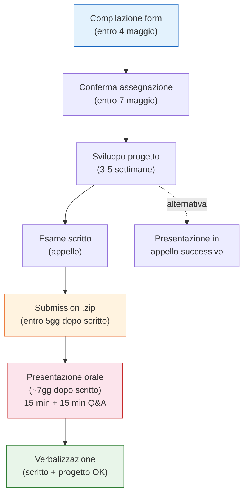
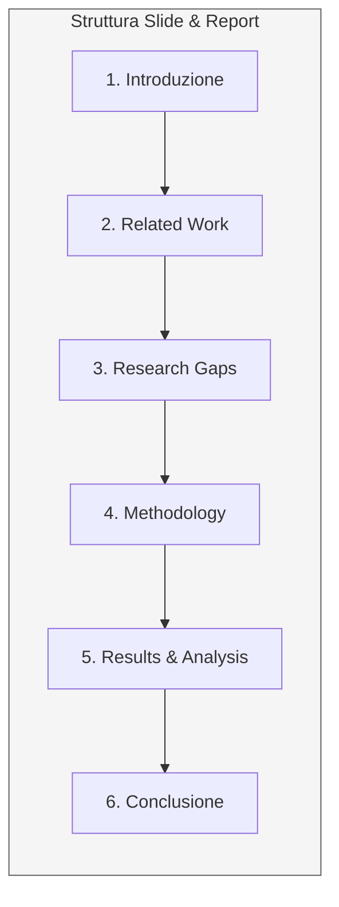
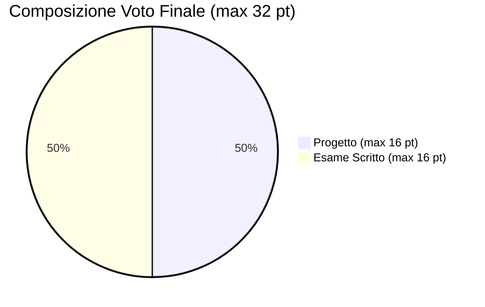

# Indicazioni per la consegna del progetto

Le modalità di consegna, le scadenze e i principali vincoli del progetto del corso di Explainable and Trustworthy AI sono comuni ai progetti proposti, incluso il progetto 5.[file:12]

## Gruppo e scelta del progetto

- Occorre selezionare uno dei progetti proposti dal corso e formare un gruppo di 3 persone.[file:12]
- La scelta del progetto va comunicata compilando un form online una sola volta per gruppo, inserendo matricola, nome e cognome di tutti i componenti.[file:12]
- La compilazione del form deve avvenire entro il 4 maggio.[file:12]
- La conferma ufficiale dell'assegnazione del progetto viene pubblicata entro il 7 maggio.[file:12]

## Modalità di consegna

- Il materiale del progetto deve essere caricato sul Portale della Didattica, nella sezione “Elaborati”.[file:12]
- La consegna deve avvenire sotto forma di un unico archivio `.zip`.[file:12]
- Lo `.zip` deve includere le slide della presentazione, il documento di supporto, il codice in un repository pubblico e i dati utilizzati.[file:12]

## Materiale richiesto

- È richiesto un breve documento di recap di circa 2–3 pagine, che servirà da supporto alla discussione e sarà letto dai docenti prima della presentazione.[file:12]
- Per questo documento verrà fornito un template da seguire.[file:12]
- Va inoltre preparata una presentazione orale della durata di 15 minuti, seguita da 15 minuti di discussione.[file:12]

## Struttura consigliata

La struttura consigliata sia per le slide sia per il brief recap report è la seguente:[file:12]

1. Introduzione.[file:12]
2. Related work / Literature review.[file:12]
3. Research gap discussion e identificazione dei gap.[file:12]
4. Methodology and implementation.[file:12]
5. Results and analysis.[file:12]
6. Conclusione breve.[file:12]

## Deadline e presentazione

- La submission del progetto, comprensiva di recap document e slide, deve avvenire al massimo 5 giorni dopo l'esame scritto dell'appello in cui si intende far valere il progetto.[file:12]
- La presentazione si svolge approssimativamente 7 giorni dopo lo scritto, secondo slot compatibili fissati dai docenti.[file:12]
- Il progetto resta valido per l'intero anno accademico.[file:12]

## Vincoli e flessibilità

- Non è obbligatorio sostenere progetto e scritto nello stesso appello.[file:12]
- È possibile sostenere prima lo scritto e presentare il progetto in un appello successivo, oppure viceversa.[file:12]
- La verbalizzazione finale avviene quando risultano superati sia il progetto sia l'esame scritto.[file:12]

## Valutazione

- Il progetto vale fino a 16 punti.[file:12]
- La valutazione del progetto considera literature review, research gaps, metodologia e assessment, originalità o novità, discussione e analisi, e chiarezza.[file:12]
- L'esame scritto vale anch'esso fino a 16 punti ed è basato sugli argomenti del corso.[file:12]
