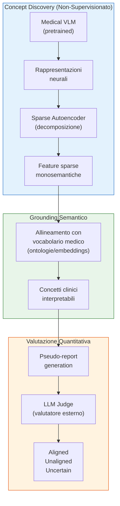
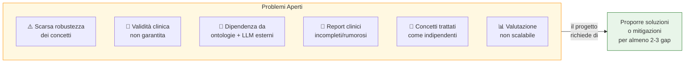
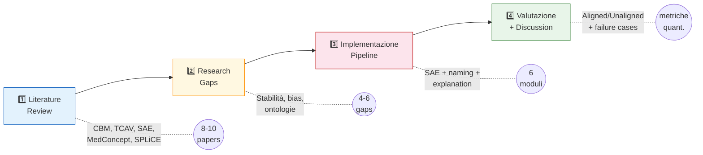
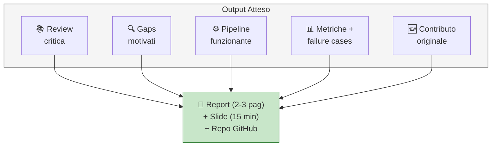

# Progetto 5 — Unsupervised Concept Discovery and Evaluation for Medical Vision–Language Models

Il progetto 5 del corso di Explainable and Trustworthy AI è dedicato allo studio della scoperta non supervisionata di concetti e della valutazione quantitativa dell'interpretabilità nei medical Vision–Language Models (VLM), prendendo come riferimento il framework MedConcept.[file:11]

## Obiettivo del progetto

L'obiettivo principale è analizzare come estrarre concetti latenti da modelli vision-language in ambito medico e come utilizzare questi concetti per migliorare l'interpretabilità del modello.[file:11] Il progetto richiede di studiare sia la fase di concept discovery sia la fase di evaluation, con particolare attenzione al ruolo di modelli linguistici esterni nella verifica dell'allineamento semantico tra concetti scoperti ed evidenza testuale clinica.[file:11]

## Contesto scientifico

I medical Vision–Language Models hanno mostrato risultati molto forti in compiti clinici come classificazione di patologie, segmentazione e generazione di referti.[file:11] Tuttavia, le loro rappresentazioni interne sono spesso ad alta dimensionalità, polisemiche e difficili da interpretare, il che riduce la trasparenza del modello in contesti safety-critical come quello medico.[file:11]

Le tecniche classiche di interpretabilità, per esempio saliency map e attention visualization, producono spiegazioni locali ma spesso non riescono a catturare la struttura semantica interna delle rappresentazioni apprese dal modello.[file:11] Per questo motivo, esse offrono una vista limitata di come il modello organizza davvero la conoscenza medica.[file:11]

## Idea chiave del progetto

Il progetto si colloca nell'area della concept-based explainability, cioè un insieme di approcci che cercano di spiegare le predizioni in termini di concetti interpretabili dall'essere umano.[file:11] In questo caso il focus è su approcci non supervisionati, che cercano di scoprire concetti automaticamente a partire da rappresentazioni pretrained, senza richiedere annotazioni manuali dei concetti.[file:11]

Nel framework MedConcept, la scoperta dei concetti avviene attraverso sparse autoencoders, che servono a decomporre le rappresentazioni neurali in feature sparse e più semanticamente significative.[file:11] Le feature ottenute vengono poi allineate a un vocabolario medico curato, derivato da ontologie come UMLS, in modo da associare attivazioni latenti a concetti clinici interpretabili.[file:11]

## Perché il problema è importante

In ambito medico non basta che un modello sia accurato: serve anche capire su quali segnali e concetti si basa una predizione.[file:11] Questo è particolarmente importante perché spiegazioni poco affidabili o concetti scoperti in modo ambiguo possono portare a una fiducia ingiustificata nel comportamento del sistema.[file:11]

Un altro aspetto centrale è la valutazione dell'interpretabilità.[file:11] Molti lavori precedenti si basano soprattutto su ispezione qualitativa, che è soggettiva e poco scalabile; MedConcept propone invece un'impostazione quantitativa usando tre metriche chiamate Aligned, Unaligned e Uncertain, che misurano accordo semantico, contraddizione e ambiguità rispetto ai report clinici.[file:11]

## Problemi aperti evidenziati dal progetto

Il testo del progetto sottolinea diversi limiti degli approcci attuali.[file:11] Tra questi ci sono la possibile scarsa robustezza dei concetti scoperti, la loro validità clinica non sempre garantita, la dipendenza da ontologie e large language models esterni, e il fatto che i report clinici usati per l'evaluation possono essere incompleti, rumorosi o selettivi.[file:11]

Inoltre, molti approcci trattano i concetti come entità indipendenti, ignorando relazioni strutturate naturali tra concetti medici, come gerarchie anatomiche o dipendenze causali.[file:11] Un'altra difficoltà importante è costruire procedure di valutazione dell'interpretabilità che siano quantitative, riproducibili e scalabili.[file:11]

## Attività richieste

### 1. Literature review

È richiesta una review sistematica dei metodi di interpretabilità per medical Vision–Language Models.[file:11] In particolare, bisogna coprire approcci di concept-based explainability come Concept Bottleneck Models e TCAV, oltre ai lavori recenti sulla scoperta non supervisionata di concetti tramite sparse autoencoders e tecniche di representation disentanglement.[file:11]

La review deve includere anche i metodi di valutazione delle spiegazioni già esistenti, in particolare quelli basati su large language models come giudici semantici, mettendone in evidenza vantaggi e limiti.[file:11]

### 2. Identificazione dei research gaps

Bisogna individuare chiaramente i limiti della letteratura attuale.[file:11] Il progetto suggerisce di concentrarsi sulla mancanza di garanzie sulla stabilità e validità semantica dei concetti, sulla dipendenza da risorse esterne e sulla debolezza delle procedure di valutazione quando i report clinici sono incompleti o rumorosi.[file:11]

Va inoltre analizzata l'assenza di relazioni strutturate tra concetti e la difficoltà di definire metriche di interpretabilità realmente affidabili e riproducibili.[file:11]

### 3. Implementazione

È necessario progettare e implementare una pipeline semplificata di unsupervised concept discovery ispirata ai framework più recenti.[file:11] Le possibili direzioni indicate dal testo sono diverse.[file:11]

- Addestrare uno sparse autoencoder per estrarre concetti latenti da embedding visuali o multimodali pretrained.[file:11]
- Allineare le feature latenti con concetti testuali attraverso similarity matching in uno spazio di embedding condiviso.[file:11]
- Generare spiegazioni concept-based per singoli campioni, identificando i concetti più attivati.[file:11]
- Esplorare semplici estensioni, per esempio filtraggio, clustering o organizzazione strutturata dei concetti scoperti.[file:11]

### 4. Valutazione

La pipeline proposta deve essere valutata su almeno un dataset.[file:11] L'evaluation deve combinare analisi qualitative e quantitative dell'interpretabilità.[file:11]

Tra gli aspetti richiesti ci sono la qualità dei concetti scoperti, il loro allineamento semantico e la consistenza delle spiegazioni generate.[file:11] Il testo suggerisce esplicitamente di implementare o adattare metriche come Aligned, Unaligned e Uncertain, e di analizzare anche failure cases come concetti ambigui o spurii e la sensibilità a diverse scelte progettuali.[file:11]

## Competenze che il progetto mette in gioco

Il progetto combina più competenze tipiche della XAI moderna.[file:11] Richiede infatti comprensione teorica della concept-based explainability, capacità di leggere e sintetizzare articoli recenti, competenze implementative su rappresentazioni neurali e autoencoder sparsi, e capacità di progettare una valutazione sperimentale rigorosa.[file:11]

Dal punto di vista pratico, è un progetto adatto a chi vuole lavorare all'intersezione tra interpretabilità, representation learning e AI for healthcare.[file:11] Rispetto ad altri progetti del corso, questo ha una forte componente metodologica e un forte interesse per la misurazione dell'affidabilità delle spiegazioni, non solo per la loro generazione.[file:11]

## Output atteso

Un buon risultato finale dovrebbe mostrare una pipeline coerente per la scoperta di concetti latenti, un criterio chiaro per associare tali concetti a significati clinici e una valutazione ben motivata della qualità interpretativa delle spiegazioni ottenute.[file:11] Non basta quindi far funzionare un modello: bisogna anche discutere criticamente quanto i concetti siano stabili, significativi e realmente utili per comprendere il comportamento del VLM.[file:11]

## In sintesi operativa

In termini concreti, il progetto 5 chiede di fare quattro cose principali:[file:11]

1. Studiare la letteratura sui metodi concept-based e sulla loro evaluation.[file:11]
2. Identificare limiti aperti nella scoperta e valutazione di concetti nei medical VLM.[file:11]
3. Implementare una pipeline semplificata di concept discovery non supervisionato.[file:11]
4. Valutare i concetti e le spiegazioni con metriche qualitative e quantitative, discutendo anche i failure cases.[file:11]
