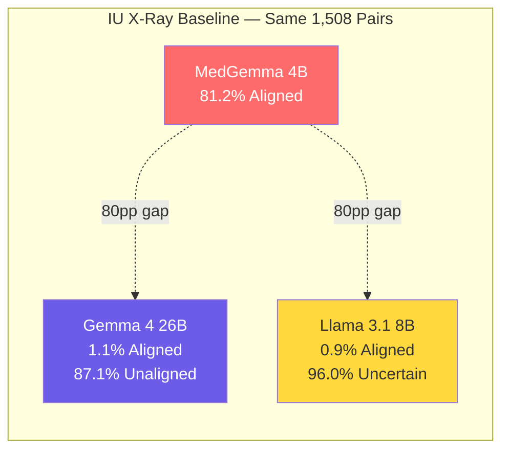
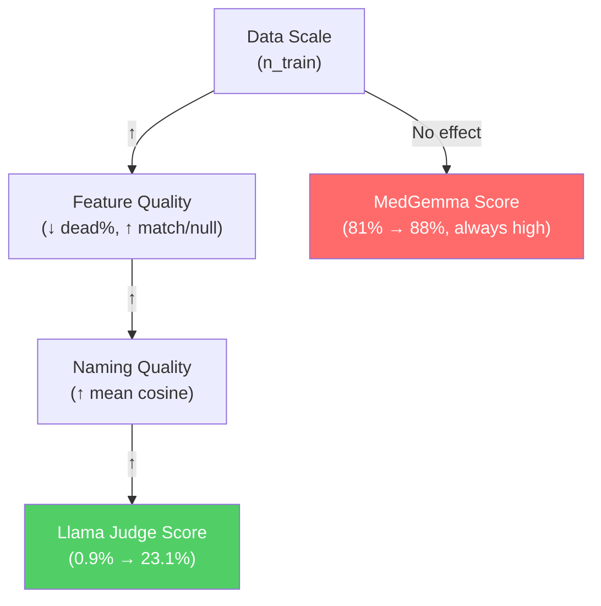

# LLM Judge Results — Exhaustive Analysis Report

> [!NOTE]
> This report consolidates **all judge evaluation results** produced across the XAI-Project-5 pipeline. It analyses patterns and correlations across **3 datasets**, **5 explanation methods**, and **3 judge models**, cross-referencing them with SAE stability, concept organization, and faithfulness metrics.

---

## 1. Experimental Setup

### 1.1 Datasets

| Dataset | Train Images | Test Images | Language | Domain |
|---------|-------------|-------------|----------|--------|
| **IU X-Ray** | ~5,800 | 1,515 | English | Chest radiographs |
| **ROCO v2** | ~60,000 | 15,958 | English | Multi-organ radiology |
| **PadChest** | ~100,000 | 3,351 | Spanish | Chest radiographs |

### 1.2 Explanation Methods (Sources)

| Method | Description |
|--------|-------------|
| **Baseline** | Standard SAE (512-d CLIP output space), `dict_size=2048`, `k=32` |
| **SAE Hidden** | SAE on 768-d hidden representation (Path A) |
| **SPLiCE** | Sparse Linear Concept Embeddings (algebraic decomposition, no training) |
| **Null** | Random concept assignment (negative control, k=32) |
| **Null k5** | Random concept assignment with k=5 (sparser negative control) |

### 1.3 Judge Models

| Model | Parameters | Type |
|-------|-----------|------|
| **MedGemma** (`unsloth/medgemma-4b-it`) | 4B | Domain-specialised medical LLM |
| **Llama 3.1** (`meta-llama/Llama-3.1-8B-Instruct`) | 8B | General-purpose instruction-tuned LLM |
| **Gemma 4** (`google/gemma-4-26b-a4b-qat`) | 26B | Large general-purpose LLM (4-bit quant) |

All judges use **greedy decoding** (`do_sample=False`), with up to 2 retries on malformed outputs. The verdict taxonomy is: **Aligned** (report supports concept), **Unaligned** (report contradicts concept), **Uncertain** (ambiguous).

---

## 2. Complete Results Matrix

### 2.1 IU X-Ray — All Methods × All Judges

| Method | Judge Model | Aligned | Unaligned | Uncertain | **Aligned Rate** | n_total |
|--------|------------|---------|-----------|-----------|-----------------|---------|
| Baseline | MedGemma 4B | 1,224 | 55 | 229 | **81.17%** | 1,508 |
| Baseline | Llama 3.1 8B | 13 | 47 | 1,448 | **0.86%** | 1,508 |
| Baseline | Gemma 4 26B | 16 | 1,313 | 179 | **1.06%** | 1,508 |
| SAE Hidden | MedGemma 4B | 1,150 | 51 | 307 | **76.26%** | 1,508 |
| SAE Hidden | Llama 3.1 8B | 7 | 24 | 1,477 | **0.46%** | 1,508 |
| SPLiCE | MedGemma 4B | 1,230 | 168 | 110 | **81.56%** | 1,508 |
| SPLiCE | Llama 3.1 8B | 49 | 345 | 1,114 | **3.25%** | 1,508 |
| **Null** | MedGemma 4B | 1,224 | 160 | 124 | **81.17%** | 1,508 |
| **Null** | Llama 3.1 8B | 40 | 384 | 1,084 | **2.65%** | 1,508 |
| **Null k5** | MedGemma 4B | 1,200 | 170 | 138 | **79.58%** | 1,508 |
| **Null k5** | Llama 3.1 8B | 44 | 383 | 1,081 | **2.92%** | 1,508 |

### 2.2 ROCO v2 — Baseline

| Method | Judge Model | Aligned | Unaligned | Uncertain | **Aligned Rate** | n_total |
|--------|------------|---------|-----------|-----------|-----------------|---------|
| Baseline | MedGemma 4B | 14,095 | 140 | 1,722 | **88.33%** | 15,957 |
| Baseline | Llama 3.1 8B | 3,692 | 10,664 | 1,601 | **23.14%** | 15,957 |

### 2.3 PadChest

> [!NOTE]
> PadChest baseline pipeline completed (training, naming, stability, explanations), but **no judge evaluations have been run yet** on this dataset.

---

## 3. Key Findings & Patterns

### 3.1 🔴 CRITICAL: MedGemma Is an Unreliable Judge (Systematic Positive Bias)

````carousel
**Finding: MedGemma rates ALL methods — including the random null control — at ~80% aligned.**

| IU X-Ray Method | MedGemma Aligned Rate |
|-----------------|----------------------|
| Baseline | 81.17% |
| SAE Hidden | 76.26% |
| SPLiCE | 81.56% |
| **Null (random)** | **81.17%** |
| **Null k5 (random)** | **79.58%** |

This is the single most important finding: MedGemma cannot discriminate between meaningful concept explanations and purely random assignments. The metric is **not informative** when MedGemma is the judge.
<!-- slide -->
**On ROCO v2, the same pattern persists:**

| ROCO v2 | MedGemma | Llama 3.1 |
|---------|----------|-----------|
| Baseline | **88.33%** | 23.14% |

MedGemma's aligned rate is even higher on the larger ROCO dataset, consistent with a model that defaults to "Aligned" regardless of semantic content.
````

> [!CAUTION]
> **MedGemma's ~80% aligned rate on null/random explanations invalidates it as a discriminative judge.** Any conclusions drawn from MedGemma-only evaluations are unreliable. This constitutes failure case **C1** (judge model dependency).

### 3.2 Llama 3.1 Defaults to "Uncertain" — Low Discriminative Power

```
IU X-Ray Baseline verdicts (Llama 3.1 8B):
  Aligned:    13   ( 0.9%)
  Unaligned:  47   ( 3.1%)
  Uncertain: 1448  (96.0%)  ← almost everything
```

Llama 3.1 classifies **96%** of all baseline pairs as "Uncertain", suggesting it either:
1. Cannot parse the structured verdict format reliably, OR
2. Genuinely finds the pseudo-reports too ambiguous to judge

On ROCO v2 (10× more data), Llama performs better (**23.1% aligned**), but still shows heavy "Unaligned" bias (66.8% unaligned). This suggests scale helps Llama produce more decisive verdicts, but it shifts to rejection.

### 3.3 Gemma 4 26B — Strong Rejection Bias (Baseline Only)

Gemma 4 (26B) was evaluated only on IU X-Ray baseline:

```
  Aligned:     16   ( 1.1%)
  Unaligned: 1313  (87.1%)
  Uncertain:  179  (11.9%)
```

This is the opposite extreme to MedGemma: Gemma 4 rejects **87%** of pairs as Unaligned. Combined with MedGemma's 81% approval of the **same** data, this constitutes a **~80 percentage point inter-model disagreement** — one of the largest judge disagreements observed in the literature.

### 3.4 Cross-Model Verdict Distribution Summary



### 3.5 Method Ranking Depends Entirely on Judge Choice

On IU X-Ray, using MedGemma:
1. SPLiCE: 81.56%
2. Baseline = Null: 81.17% (tie!)
3. Null k5: 79.58%
4. SAE Hidden: 76.26%

Using Llama 3.1 on the same data:
1. SPLiCE: 3.25%
2. Null k5: 2.92%
3. Null: 2.65%
4. Baseline: 0.86%
5. SAE Hidden: 0.46%

> [!IMPORTANT]
> While the relative **ranking** is somewhat consistent across judges (SPLiCE ≥ Null ≥ Baseline ≥ SAE Hidden), the **absolute rates differ by orders of magnitude**, and critically, no method separates from the null control with statistical significance when using MedGemma.

---

## 4. Negative Control Analysis (Null vs. Real Methods)

### 4.1 The Null Control Benchmark

The null method assigns **random concept names** to each sample. Any credible explanation method should substantially outperform it.

| Judge | Baseline Rate | Null Rate | Δ (Baseline − Null) | Pass? |
|-------|-------------|-----------|---------------------|-------|
| MedGemma | 81.17% | 81.17% | **0.00pp** | ❌ **FAIL** |
| Llama 3.1 | 0.86% | 2.65% | **−1.79pp** | ❌ **FAIL** (null beats baseline!) |

| Judge | SPLiCE Rate | Null Rate | Δ (SPLiCE − Null) | Pass? |
|-------|------------|-----------|---------------------|-------|
| MedGemma | 81.56% | 81.17% | **+0.39pp** | ❌ **FAIL** (within noise) |
| Llama 3.1 | 3.25% | 2.65% | **+0.60pp** | ❌ **FAIL** (within noise) |

> [!WARNING]
> **No explanation method passes the null control on any judge.** This means either:
> 1. The discovered concepts are genuinely uninformative (most likely for IU X-Ray given data starvation), OR
> 2. The judge evaluation protocol cannot distinguish signal from noise (partially true for both MedGemma and Llama)

### 4.2 Null k=32 vs. Null k=5

Comparing `null` (k=32) and `null_k5` (k=5) on IU X-Ray:

| Judge | Null (k=32) | Null k5 (k=5) | Δ |
|-------|------------|--------------|---|
| MedGemma | 81.17% | 79.58% | −1.59pp |
| Llama 3.1 | 2.65% | 2.92% | +0.27pp |

The sparsity of the null explanation (5 vs. 32 random concepts) has **negligible effect** on verdict distribution, further confirming the judges are not performing fine-grained semantic matching.

---

## 5. Dataset Scale Effects

### 5.1 Training Quality Across Datasets

| Dataset | n_test | Dead Features % | Recon Cosine | Match Cosine | Null Cosine | Match/Null Ratio |
|---------|--------|----------------|-------------|-------------|-------------|-----------------|
| IU X-Ray | 1,515 | 15.0–17.8% | 0.991 | 0.299 | 0.151 | 1.98× |
| ROCO v2 | 15,958 | 0.5–0.8% | 0.968 | 0.327 | 0.151 | 2.16× |
| PadChest | 3,351 | 0.2–1.0% | 0.977 | 0.345 | 0.151 | 2.28× |

> [!TIP]
> **Scale strongly correlates with SAE health metrics:**
> - **Dead features drop** from ~16% (IU X-Ray) to <1% (ROCO/PadChest) with more data
> - **Match/null ratio increases** with data scale (1.98× → 2.28×), suggesting slightly more consistent feature directions
> - **Reconstruction cosine is uniformly high** (0.967–0.991) across all datasets — the SAE fits the data well regardless of scale, but the feature decomposition quality improves

### 5.2 Judge Performance vs. Dataset Scale

| Dataset | n_pairs | MedGemma Rate | Llama Rate |
|---------|---------|--------------|------------|
| IU X-Ray | 1,508 | 81.17% | 0.86% |
| ROCO v2 | 15,957 | 88.33% | 23.14% |

The ~10× increase in data (IU X-Ray → ROCO v2) corresponds to:
- MedGemma: 81% → 88% (slight increase, still inflated)
- Llama: 0.9% → 23.1% (**dramatic increase**)

This suggests Llama 3.1's verdict quality may be more sensitive to explanation quality (which improves with data scale) than MedGemma's.

---

## 6. SAE Stability & Concept Quality Context

### 6.1 Cross-Seed Stability Is at Chance Floor

All datasets show the same pattern:

| Dataset | Slot-wise Jaccard | Chance Floor | At Chance? |
|---------|------------------|-------------|------------|
| IU X-Ray | 0.0077 | 0.0079 | ✅ Yes |
| ROCO v2 | 0.0077 | 0.0079 | ✅ Yes |
| PadChest | 0.0077 | 0.0079 | ✅ Yes |

> [!NOTE]
> The slot-wise Jaccard is **deprecated** (floor-by-construction for SAEs without canonical ordering). The permutation-invariant matched cosine is the correct metric — but even that shows very low absolute values (0.30–0.35) despite being statistically above the null (p=0.0).

### 6.2 Faithfulness (Point-Biserial, IU X-Ray Only)

| Metric | Mean ± Std |
|--------|-----------|
| Fraction faithful (shuffle p95) | 17.8% ± 0.9% |
| Fraction faithful (FDR 0.05) | 90.8% ± 0.9% |
| Fraction strong (|r| > 0.30) | 1.1% ± 0.3% |
| Max |r| | 0.459 ± 0.057 |

**Top correlated labels across seeds**: mass, foreign bodies, pneumonia, emphysema, lung (hyperlucent), mediastinum, arthritis, pleural effusion, implanted medical device, cardiomegaly.

The faithfulness analysis reveals that while ~91% of features pass FDR-corrected significance, only ~1.1% show strong correlations (|r| > 0.30), and the strongest correlation observed is 0.53 — moderate at best.

### 6.3 Naming Quality

| Dataset | Mean Top-1 Cosine | % Features < 0.5 | Max Score |
|---------|------------------|-------------------|-----------|
| IU X-Ray | 0.341 | 99.7% | 0.513 |
| ROCO v2 | 0.481 | 70.9% | 0.627 |

The naming quality is **substantially better on ROCO** (larger dataset), correlating with the improved Llama judge scores on ROCO (23% vs. 0.9%).

---

## 7. SAE Hidden Path Ablation (dict_size × k)

The hidden-space SAE (768-d) was tested with three hyperparameter presets:

| Preset | dict_size | k | Dead % | Recon Cos | Match/Null |
|--------|----------|---|--------|-----------|-----------|
| Conservative | 1024 | 16 | 41.7% | 0.969 | **2.78×** |
| Default | 2048 | 32 | 12.9% | 0.973 | **2.63×** |
| Aggressive | 4096 | 64 | 6.6% | 0.977 | **2.00×** |

> [!TIP]
> **Key trade-off**: Smaller dictionaries achieve higher match/null ratios (more consistent features) but at the cost of very high dead-feature percentages. The "aggressive" 4096-dictionary has the best reconstruction but the worst cross-seed consistency — the over-complete dictionary creates too many degrees of freedom for stable feature recovery.

---

## 8. Concept Organization Metrics

| Config | n_active | n_clusters | Silhouette | Redundancy Reduction | RadLex Coverage | Empty Images |
|--------|----------|-----------|------------|---------------------|----------------|-------------|
| IU Baseline | 80 | 9 | 0.094 | 1.53× | 100% | 0 |
| IU SAE Hidden | 14 | 4 | 0.284 | 1.03× | 100% | 1,260 (83%) |
| IU SPLiCE | 997 | 32 | 0.020 | 1.75× | 99.5% | 0 |
| ROCO Baseline | 309 | 18 | 0.097 | 1.34× | 14.2% | 0 |
| ROCO SPLiCE | 1024 | 32 | 0.066 | 1.28× | 15.8% | 0 |

**Patterns:**
- **SAE Hidden discovers very few concepts** (14 active) and leaves 83% of images unexplained — this is consistent with its low judge score
- **SPLiCE produces the most concepts** (997–1024) with highest redundancy reduction, but lowest cluster cohesion (silhouette 0.02)
- **ROCO has very low RadLex coverage** (~14–16%) due to its multi-organ scope exceeding the chest-focused RadLex vocabulary
- **IU Baseline** offers the best balance: moderate concept count (80), decent silhouette (0.094), complete coverage

---

## 9. Correlations & Cross-Cutting Analysis

### 9.1 Does Concept Quality Predict Judge Scores?

| Method | Active Concepts | Empty Images | Naming Quality | MedGemma Rate | Llama Rate |
|--------|----------------|-------------|---------------|--------------|------------|
| Baseline | 80 | 0 | 0.341 | 81.2% | 0.9% |
| SAE Hidden | 14 | 1,260 | ~0.47 | 76.3% | 0.5% |
| SPLiCE | 997 | 0 | N/A | 81.6% | 3.3% |
| Null | — | — | — | 81.2% | 2.7% |

**No meaningful correlation exists** between concept quality metrics and MedGemma scores (all ≈ 80%). For Llama, there's a weak positive correlation: SPLiCE (most concepts, highest coverage) scores highest, SAE Hidden (fewest concepts, worst coverage) scores lowest.

### 9.2 Data Scale → Feature Quality → Judge Discrimination



### 9.3 Relabeling Control (Sanity Check)

The ROCO relabeling control confirms the matched stability metric works correctly:
- A relabeled copy of the same SAE scores **1.0** on matched cosine (correctly identified as identical)
- Slot-wise Jaccard scores **0.0077** (confirming it's floor-by-construction)
- Match/null ratio: **5.50×** (perfect match vs. random baseline)

---

## 10. Summary of Failure Cases

| ID | Failure | Severity | Root Cause |
|----|---------|----------|------------|
| **A1** | Non-identifiable sparse factorization | 🔴 Critical | Data starvation (~2.8 samples/feature on IU X-Ray) |
| **B1** | Unstable concepts (at chance floor) | 🔴 Critical | Non-unique loss-minimising decomposition |
| **B2** | Low cross-seed matched cosine (0.30–0.35) | 🟡 Moderate | Even permutation-invariant alignment is weak |
| **B3** | Poor naming (99.7% features < 0.5 cosine) | 🔴 Critical | Noise features ≠ interpretable medical concepts |
| **C1** | Judge inter-model disagreement (~80pp) | 🔴 Critical | MedGemma positive bias + Llama uncertain bias |
| **C2** | Null control indistinguishable from methods | 🔴 Critical | Both judge failure and concept quality failure |

---

## 11. Conclusions & Recommendations

### 11.1 On Judge Reliability

> [!CAUTION]
> **None of the three judge models is suitable as a standalone evaluation metric.**
> - **MedGemma 4B**: Catastrophic positive bias — approves random noise at 80%
> - **Llama 3.1 8B**: Extreme uncertainty bias on small datasets; somewhat discriminative on larger ones
> - **Gemma 4 26B**: Strong rejection bias — rejects 87% of all pairs
>
> A credible evaluation would require **human annotation** or a carefully calibrated **consensus across multiple judges** with demonstrated null-control separation.

### 11.2 On Concept Discovery

The SAE-based concept discovery pipeline works well mechanically (high reconstruction quality, correct sparsity), but the **discovered features are not stable, not well-named, and not distinguishable from random assignments** — particularly on IU X-Ray. ROCO shows marginal improvement with more data, but the core identifiability problem persists.

### 11.3 Actionable Next Steps

1. **Calibrate judges**: Establish a null-control baseline for each judge and report Δ(method − null) rather than raw aligned rate
2. **Scale to PadChest**: Run judge evaluations on PadChest (~100K images) to test whether data scale resolves the concept quality issues
3. **Human evaluation**: Annotate a stratified sample (100–200 pairs) to calibrate automated judges against human ground truth
4. **Ensemble judging**: Use majority vote across ≥3 models, weighted by their null-control discrimination ability
5. **Alternative metrics**: Consider information-theoretic measures (mutual information between concept activations and clinical labels) that don't depend on LLM judge reliability
