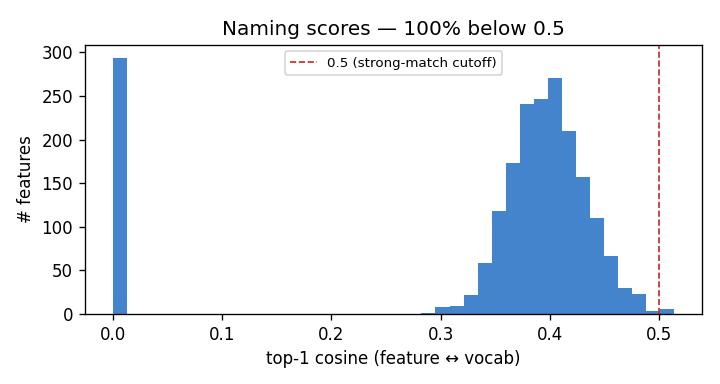
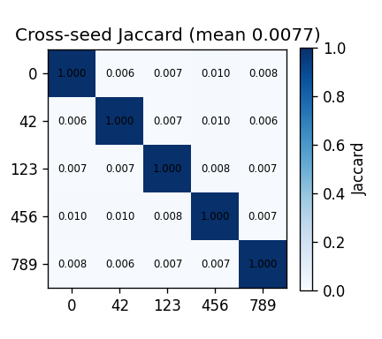

# iu_xray — Failure-Case Analysis

_Generated by `scripts/run_failure_case_analysis.py` from the baseline run artifacts in `results/iu_xray/`. Frames the results as the **failure cases** the traccia requires, with the root cause and a forward link to the multi-dataset plan. See `docs/FINDINGS.md` for the paper angles._

## TL;DR

The SAE discovers **unstable, near-random concepts**: cross-seed Jaccard sits at the **chance floor** (0.0077 vs 0.0079), the top-1 naming cosine is ~0.34 (100% of features < 0.5), and three judge models return **contradictory** verdict distributions on the same pseudo-reports. Root cause: **data starvation** (≈2.8 samples/feature) → a **non-identifiable** sparse factorization (see FINDINGS A1, B1).

## 1. Naming failure — visual↔textual alignment is noise (B3)

- Features: **2048** (294 dead, 14.4%).
- Top-1 cosine: mean **0.341**, median 0.390, max **0.513**.
- **99.7%** of features score < 0.5 → essentially none have a strong vocab match.

**Top-15 'best' concepts** (highest score — what the SAE is most confident about):
  - drug-induced disorder (0.513)
  - arteriovenöse Fistel (0.506)
  - ectopic pregnancy (0.504)
  - psoriatic arthritis (0.503)
  - drug-induced disorder (0.502)
  - penetrating injury (0.502)
  - pharyngeal pouch (0.499)
  - Type II vascular malformation of spinal cord (0.495)
  - blind pouch syndrome (0.491)
  - Detrusorareflexie (0.487)
  - urethral stenosis (0.485)
  - psoriatic arthritis (0.485)
  - salivary calculus (0.484)
  - broad based disc extrusion (0.484)
  - acinar cell adenoma (0.483)

These are anatomically irrelevant to chest radiographs (ear/leg anatomy, German-localised device labels from RadLex) — the cosine argmax is noise, not a discovered chest concept.

## 2. Stability failure — concepts are not reproducible (B2)

- Cross-seed **mean Jaccard 0.0077** vs analytical **chance floor 0.0079** (k/(2D−k), k=32, D=2048) → **at chance**.
- Reconstruction is *good* (cosine 0.991, mse 3.57e-05, L0 32) — the SAE fits the data, but the **features themselves are arbitrary**.
- Matched (permutation-invariant) best-cosine **0.299** vs null 0.151; fraction matched@0.7 = 0.002 → the *directions* don't align across seeds either.

## 3. Judge disagreement — the metric is model-dependent (C1)

_No judge checkpoints found — run the LLM judge first._

## 4. Root cause & forward link (A1, B1)

All three failures share one cause: with ~5,800 train images and `dict_size=2048` (**≈2.8 samples/feature**), the sparse factorization is **non-identifiable** — the loss-minimising decomposition is not unique and the learned directions are noise. This is the project's central failure case and it **motivates the PadChest scale test** (Phase 2): if scale is the cause, more data should raise stability off the chance floor and the naming scores above 0.5. Compare this report with `results/padchest/failure_cases/REPORT.md` once PadChest is run at scale.
