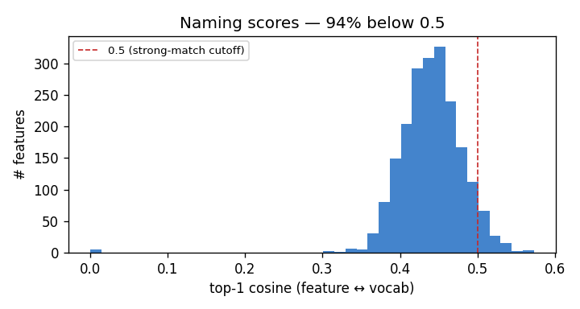
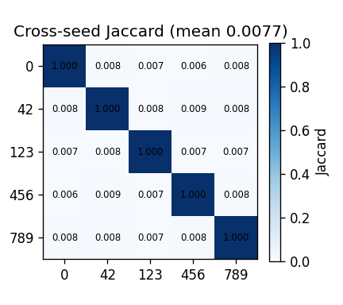

# padchest — Failure-Case Analysis

_Generated by `scripts/run_failure_case_analysis.py` from the baseline run artifacts in `results/padchest/`. Frames the results as the **failure cases** the traccia requires, with the root cause and a forward link to the multi-dataset plan. See `docs/FINDINGS.md` for the paper angles._

## TL;DR

The SAE discovers **unstable concepts**: cross-seed Jaccard sits at the **chance floor** (0.0077 vs 0.0079), the top-1 naming cosine is ~0.44 (94% of features < 0.5). Root cause: data starvation (~6.5 train samples/feature) → a non-identifiable sparse factorization (see FINDINGS A1, B1).

## 1. Naming — visual↔textual alignment (B3)

- Features: **2048** (5 dead, 0.2%). Vocab: RadLex (chest).
- Top-1 cosine: mean **0.441**, median 0.441, max **0.573**.
- **93.8%** of features score < 0.5 → most lack a strong vocab match.

**Top-15 'best' concepts** (highest score — what the SAE is most confident about):
  - Perikarditis (0.573)
  - tuberculosis (0.565)
  - Plasmazellgranulom (0.563)
  - endometritis (0.56)
  - High-flow vaskuläre Malformation (0.546)
  - Persistierende fetale Zirkulation (0.546)
  - interstitielles Lungenemphysem (0.543)
  - eosinophilic pneumonia (0.541)
  - long feeding tube (0.54)
  - closed loop hernia (0.539)
  - sialodochitis fibrinosa (0.539)
  - lobar dysmorphism (0.539)
  - Plasmazellgranulom (0.538)
  - acinar cell adenoma (0.537)
  - eosinophilic cholangitis (0.537)

The top hits are plausibly on-domain concepts — the head of the distribution is meaningful — but it is a thin tail: the **bulk** of features still lack a strong vocab match, so naming is *weak*, not absent.

## 2. Stability — are the concepts reproducible? (B2)

- Cross-seed **mean Jaccard 0.0077** vs analytical **chance floor 0.0079** (k/(2D−k), k=32, D=2048) → **at chance**.
- Reconstruction is *good* (cosine 0.976, mse 9.13e-05, L0 32) — the SAE fits the data, but the **features themselves are arbitrary**.
- Matched (permutation-invariant) best-cosine **0.345** vs null 0.151; fraction matched@0.7 = 0.001 → only a small fraction of directions align across seeds.

## 3. Judge disagreement — the metric is model-dependent (C1)

_No judge checkpoints found for `padchest` — run the LLM judge (`python src/evaluate_llm_judge.py --dataset padchest`) to populate this section._

## 4. Root cause & forward link (A1, B1, B5)

The failures share one cause: with ~13,404 train images and `dict_size=2048` (~6.5 train samples/feature), the sparse factorization is **non-identifiable** — the loss-minimising decomposition is not unique and the learned directions are noise. This **motivates the scale test**: if data quantity is the cause, more data should lift stability off the chance floor and naming scores above 0.5. The controlled tests are ROCOv2 (Phase 3, larger but broader domain) and PadChest (Phase 2, larger **same-domain** chest) — compare with `results/rocov2/failure_cases/REPORT.md` and `results/padchest/failure_cases/REPORT.md`.