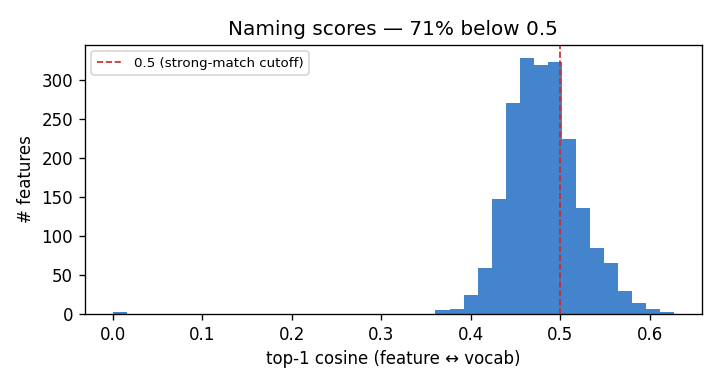
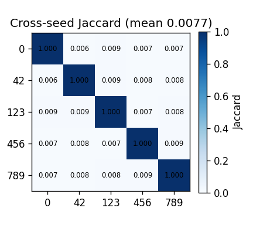

# rocov2 — Failure-Case Analysis

_Generated by `scripts/run_failure_case_analysis.py` from the baseline run artifacts in `results/rocov2/`. Frames the results as the **failure cases** the traccia requires, with the root cause and a forward link to the multi-dataset plan. See `docs/FINDINGS.md` for the paper angles._

## TL;DR

The SAE discovers **unstable, near-random concepts**: cross-seed Jaccard sits at the **chance floor** (0.0077 vs 0.0079), the top-1 naming cosine is ~0.48 (71% of features < 0.5), and three judge models return **contradictory** verdict distributions on the same pseudo-reports. Root cause: **data starvation** (≈2.8 samples/feature) → a **non-identifiable** sparse factorization (see FINDINGS A1, B1).

## 1. Naming failure — visual↔textual alignment is noise (B3)

- Features: **2048** (3 dead, 0.1%).
- Top-1 cosine: mean **0.481**, median 0.479, max **0.627**.
- **70.9%** of features score < 0.5 → essentially none have a strong vocab match.

**Top-15 'best' concepts** (highest score — what the SAE is most confident about):
  - Capillary Tubing (0.627)
  - Heart Valve Prosthesis (0.62)
  - Peripheral Nervous System (0.615)
  - Anterior Eye Segment (0.607)
  - Anterior Thalamic Nuclei (0.606)
  - Kidney Neoplasms (0.602)
  - Hip Prosthesis (0.6)
  - Skull (0.6)
  - Carcinoma, Non-Small-Cell Lung (0.596)
  - Splenic Artery (0.595)
  - Spinal Cord (0.594)
  - Liver (0.591)
  - Forearm (0.59)
  - Electroencephalography (0.589)
  - Jaw (0.587)

These are anatomically irrelevant to chest radiographs (ear/leg anatomy, German-localised device labels from RadLex) — the cosine argmax is noise, not a discovered chest concept.

## 2. Stability failure — concepts are not reproducible (B2)

- Cross-seed **mean Jaccard 0.0077** vs analytical **chance floor 0.0079** (k/(2D−k), k=32, D=2048) → **at chance**.
- Reconstruction is *good* (cosine 0.967, mse 1.26e-04, L0 32) — the SAE fits the data, but the **features themselves are arbitrary**.
- Matched (permutation-invariant) best-cosine **0.327** vs null 0.151; fraction matched@0.7 = 0.014 → the *directions* don't align across seeds either.

## 3. Judge disagreement — the metric is model-dependent (C1)

_No judge checkpoints found — run the LLM judge first._

## 4. Root cause & forward link (A1, B1)

All three failures share one cause: with ~5,800 train images and `dict_size=2048` (**≈2.8 samples/feature**), the sparse factorization is **non-identifiable** — the loss-minimising decomposition is not unique and the learned directions are noise. This is the project's central failure case and it **motivates the PadChest scale test** (Phase 2): if scale is the cause, more data should raise stability off the chance floor and the naming scores above 0.5. Compare this report with `results/padchest/failure_cases/REPORT.md` once PadChest is run at scale.
